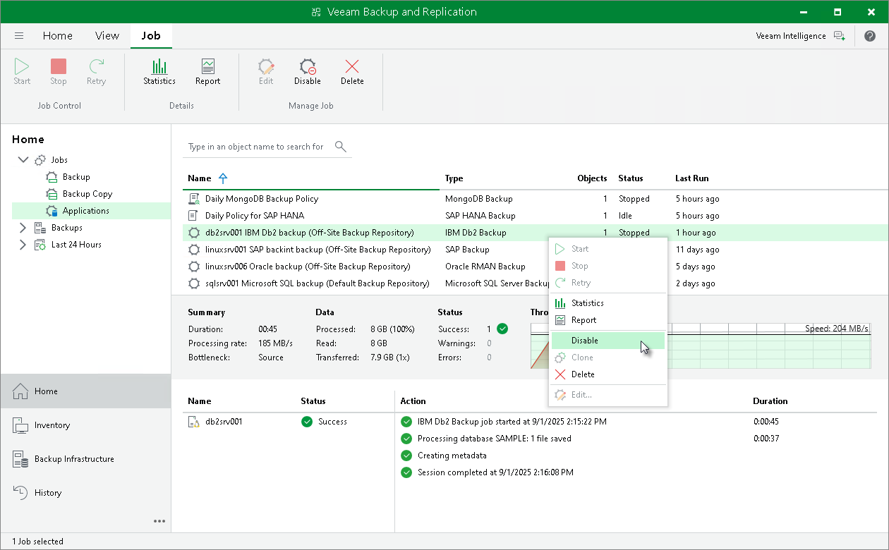

# Disabling Backup Job

In this article

You can disable Veeam Plug-In backup jobs in the Veeam Backup & Replication console. If you disable the job, you will not be able to run Veeam Plug-In backup commands on the machine with Veeam Plug-In.

To disable a backup job, do the following:

1. Open the Veeam Backup & Replication console.

1. In the Home view, expand the Jobs node in the inventory pane and click Applications Plug-ins.

1. In the working area, select the necessary job and click Disable on the ribbon. You can also right-click the job and select Disable.

Page updated 3/27/2025

Page content applies to build 13.0.1.1071
