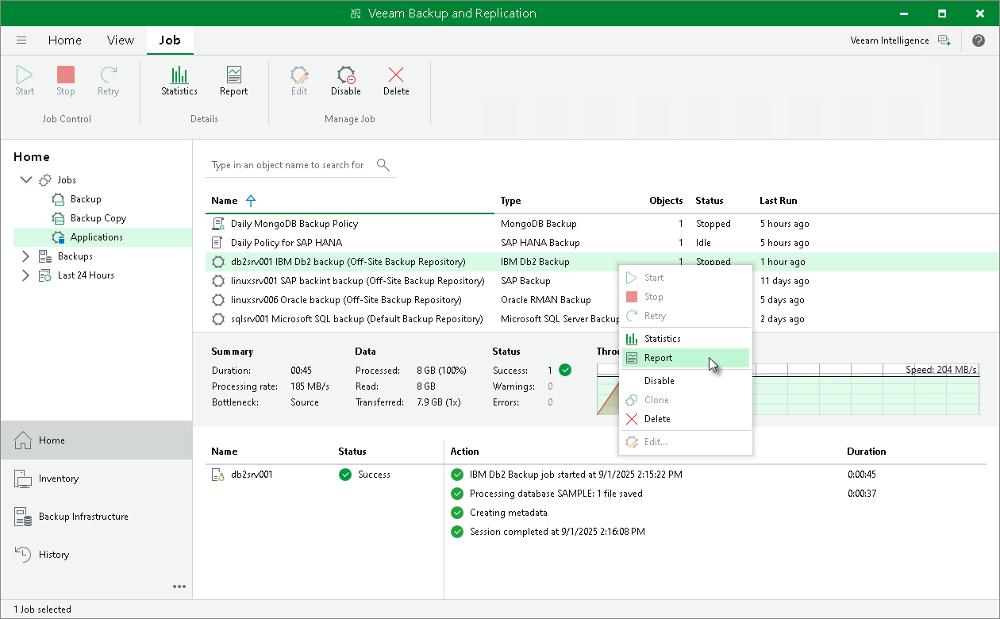

# Generating Backup Job Reports

In this article

Veeam Backup & Replication can generate reports with details about Veeam Plug-In backup job session performance. The session report contains the following session statistics: session duration details, details of the session performance, amount of read, processed and transferred data, backup size, compression ratio, list of warnings and errors (if any).

To generate a report, do the following:

1. Open the Veeam Backup & Replication console.
2. In the Home view, expand the Jobs node in the inventory pane and click Applications Plug-ins.
3. In the working area, select the necessary job and click Report on the ribbon. You can also right-click the job and select Report.

Page updated 3/27/2025

Page content applies to build 13.0.1.1071
