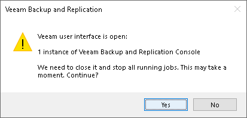
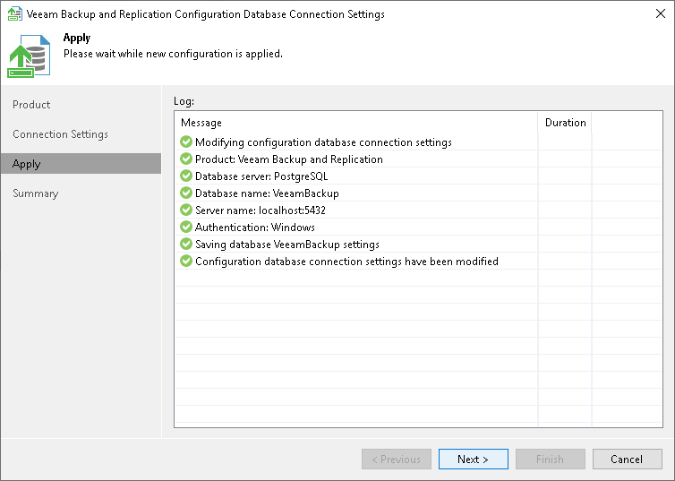

# Step 3. Apply Connection Settings

In this article

Before proceeding, the utility validates the specified settings to make sure that the user account has enough privileges to access the database.

* If you have selected the Microsoft Windows authentication method, the utility will check the privileges of the current user account (that is, the account under which the utility is running) to connect to specified Microsoft SQL Server.
* If you have selected the Microsoft SQL Server or the PostgreSQL native authentication method, the utility will check the privileges of the account you have specified.

To ensure that these accounts (as well as the account under which the Veeam Backup Service is running) have sufficient privileges for database access, you can contact your database administrator. Refer to the list of [required permissions](required_permissions.md) for Veeam Backup & Replication for detailed information.

For the new settings to be applied, the utility needs to stop Veeam Backup & Replication services and jobs that are currently running. Before proceeding to the Apply step, you must confirm the operation. After you confirm the operation by clicking Yes, Veeam Backup & Replication will force services and jobs to stop, and will apply database connection settings. For example, if you are configuring Veeam Backup & Replication database settings, the following prompt will be displayed.

Wait for the operation to complete and click Next to proceed to the Summary step of the wizard. Previously stopped services will be started again at this moment.

Page updated 5/30/2023

Page content applies to build 13.0.1.1071
