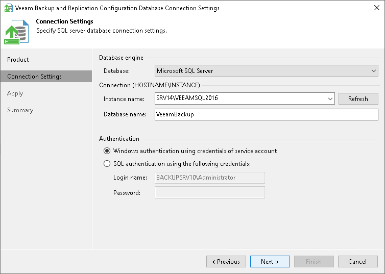

# Step 2. Specify Connection Settings

At the Connection Settings step of the wizard, provide the connection settings for the selected database.

Providing connection settings for Microsoft SQL Server:

1. Specify the Microsoft SQL Server database engine.
2. Specify an instance and a database name to which you want the Veeam Backup & Replication installation to connect in localhost\instanceName format.

Both local and remote Microsoft SQL Server instances are supported. Instances available on the network are shown in the Instance name list. If necessary, click Refresh to get the latest information.

If a database with the specified name does not exist on the selected instance, it will be created anew.

1. Select the authentication method that will be used for database connection.

+ If you plan to use the Microsoft Windows authentication, consider that the current service account will be used (that is, the account under which the Veeam Backup Service is running).
+ If you plan to use the Microsoft SQL Server native authentication, provide a login name and a password. To view the entered password, click and hold the eye icon on the right of the Password field.

Providing connection settings for PostgreSQL:

1. Specify the PostgreSQL database engine.
2. Specify an instance and a database name to which you want the Veeam Backup & Replication installation to connect in localhost:instancePort format.

Both local and remote PostgreSQL instances are supported. If a database with the specified name does not exist on the selected PostgreSQL instance, it will be created anew.

1. Select the authentication method that will be used for database connection:

+ If you plan to use the Microsoft Windows authentication, consider that the current service account will be used (that is, the account under which the Veeam Backup Service is running).
+ If you plan to use the PostgreSQL native authentication, provide a login name and a password. To view the entered password, click and hold the eye icon on the right of the Password field.

