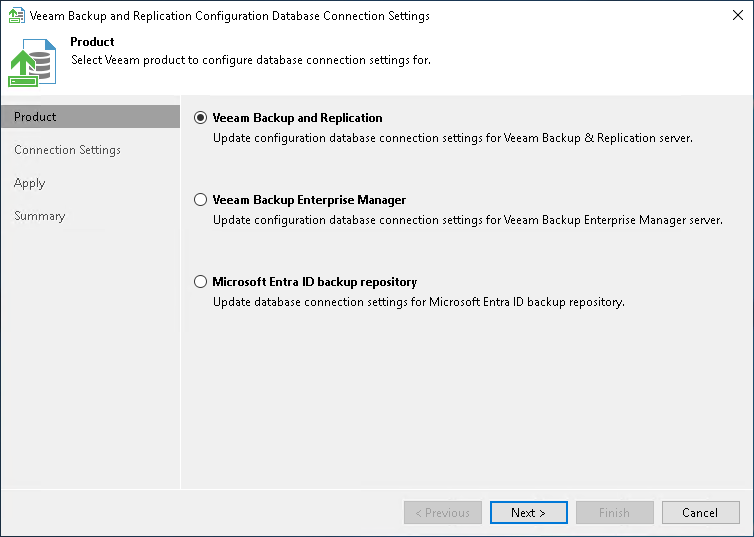

# Step 1. Select Product

At the Product step of the wizard, select the database which settings you want to configure.

The utility detects what servers are installed on the local machine and displays available products for your choice. If you want to manage connection settings for Veeam Backup Enterprise Manager or Microsoft Entra ID backup repository, see [Veeam Backup Enterprise Manager Guide](https://helpcenter.veeam.com/docs/vbr/em/dbconfig_utility.html?ver=13) or [User Guide for Microsoft Entra ID](https://helpcenter.veeam.com/docs/vbr/entraid/entra_id_connect_remote_repo.html?ver=13).

