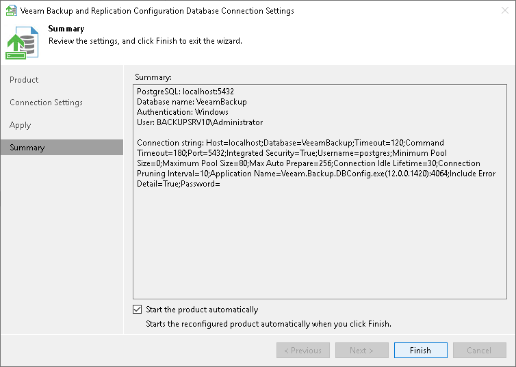

# Step 4. Finish Working with Wizard

At the Summary step of the wizard, view the information about the changes in database connection settings. If you were configuring Veeam Backup & Replication database settings and you want the Veeam backup management console to be opened automatically after you finish working with the wizard, select the Start the product automatically check box.

|  |
| --- |
| Note |
| The Start the product automatically option is not available for Veeam Backup Enterprise Manager. |

