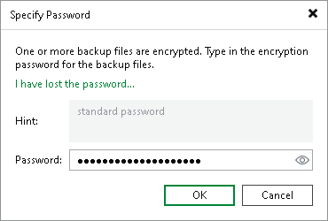
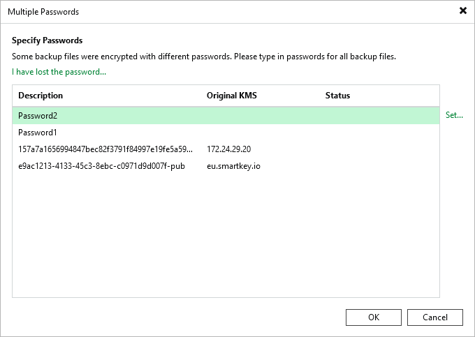

# Decrypting Backups

If you encrypt data encryption keys with KMS keys, for more information about decrypting data, see [Using KMS Keys](kms_use_keys.md).

If you encrypt data encryption keys with secret keys, do the following:

1. In the inventory pane, select the Backups > Disk (Encrypted) node.
2. In the working area, select an encrypted backup file and click Specify Password on the ribbon. Alternatively, you can right-click the backup and select Decrypt backup.
3. In the Password field, enter the password for the backup file. The password must be the same as the password that was used to encrypt the backup file.

If you enter the correct password, Veeam Backup & Replication will decrypt the backup file. The decrypted backup will be moved under the Backups > Disk (Imported) node in the inventory pane. You can perform operations with the backup file in a regular manner.

Consider the following:

* If data encryption keys are stored in the configuration database, you do not need to specify the password. In this case, data decryption is performed in the background.

* If the password has changed several times or you have changed the encryption method to KMS keys, you need to specify them in the following manner:

+ If you select a metadata file (VBM) for import, you must specify the latest KMS key or password that was used to encrypt data encryption keys.
+ If you select a full backup file (VBK) for import, you must specify the whole set of KMS keys and passwords that were used to encrypt data encryption keys.

* If you have lost or forgotten a password, you can issue a request to Veeam Backup Enterprise Manager and restore data from an encrypted file using Enterprise Manager keys. This option works only if the password loss protection is enabled. For more information, see [Password Loss Protection](encryption_password_loss_protection.md).

