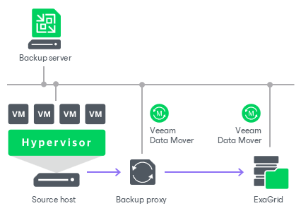

# ExaGrid

In this article

You can use ExaGrid appliances as backup repositories.

Adaptive Deduplication

ExaGrid uses adaptive deduplication. Data deduplication is performed on the target storage system. After VM data is written to disk, ExaGrid analyses bytes in the newly transferred data portions. ExaGrid compares versions of data over time and stores only the differences to disk.

ExaGrid deduplicates data at the storage level. Identical data is detected throughout the whole storage system, which increases the deduplication ratio.

Backup Infrastructure

To communicate with ExaGrid, Veeam Backup & Replication uses [Veeam Data Movers](veeam_transport_service.md). They connect to each other, process data and transfer it over LAN or WAN.

Veeam Backup & Replication uses the following Veeam Data Movers:

* Veeam Data Mover on the ExaGrid appliance
* [[For Hyper-V on-host backup](onhost_backup.md)] Veeam Data Mover on the Hyper-V host
* [[For Hyper-V off-host backup](offhost_backup.md)] Veeam Data Mover on the off-host backup proxy
* [For VMware vSphere] Veeam Data Mover on the VMware backup proxy

ExaGrid hosts Veeam Data Mover permanently. Veeam Backup & Replication installs the [persistent Veeam Data Mover](veeam_transport_service.md) during the initial connection to the appliance and then reuses the data mover when needed. This eliminates the need for runtime components and reduces potential security exposure.

Configuration on ExaGrid Side

On the ExaGrid side, do the following:

1. Create a new ExaGrid user account or update an existing one:

* Use only lowercase letters for the ExaGrid user name.
* Make sure that the ExaGrid user has the Backup Only role or another role with higher permissions.

1. Create a share on the ExaGrid appliance:

* The share must be located in the home directory of the user you set up in the previous step.
* Enable the ExaGrid-Veeam Accelerated Data Mover transport option for the created share.
* Leave default compression and deduplication settings for the share.

For more information, see the [ExaGrid documentation](https://www.exagrid.com/wp-content/uploads/ESG-Lab-Review-ExaGrid-Veeam-Accelerated-Data-Mover-October-2016.pdf).

1. Verify that the user account is added to the Veeam User Access Policy.

Configuration on Veeam Backup & Replication Side

On the Veeam Backup & Replication side, do the following:

1. Add credentials for the ExaGrid user account you created in the previous steps. For more information, see [SSH Credentials](credentials_manager_linux.md).

* When you add ExaGrid servers to the Veeam backup infrastructure, and you use the UPN format for an Active Directory account user name (for example, john.doe@domain.local), make sure you enter the user name in lowercase letters only.

* Do not select the Elevate account privileges automatically check box when setting up credentials for authentication to the ExaGrid appliance.

1. Add the ExaGrid appliance as a managed Linux server using the created credentials. For more information, see [Adding Linux Servers](add_linux_server.md).

At the Access step of the wizard, select the added SSH credentials from the drop-down list and click Optional components and advanced connection settings to configure connection ports:

1. To configure a port for a component, select the required component and click Edit. In the Component port window, specify the port number and click OK to save the changes.
2. In the Data transfer options section, provide a range of ports that will be used as a transmission channel.

After Veeam Backup & Replication connects to ExaGrid over SSH for the first time, ExaGrid creates a container. ExaGrid uses containers to isolate Veeam Enhanced Data Mover (EDM) system services from the ExaGrid operating system. Each container has its own ports.

|  |
| --- |
| Important |
| You must use different containers if you connect to the ExaGrid appliance from different backup servers. Each backup server can use only one container. |

To determine which ports must be used, go to the Veeam EDM Container page on the ExaGrid appliance. Perform this action after Veeam Backup & Replication connects to the appliance over SSH. For example, after you click Optional components and advanced connection settings at the Access step.

Typically, the ports are as follows.

|  | Installer Service | Data Mover Service | Data Transfer |
| --- | --- | --- | --- |
| Container 1  Note: If you use the first container, ports are defined automatically. You can skip the port specification. | 6160 | 6162 | 2500-3300 |
| Container 2 | 13360 | 13362 | 12500-13300 |
| Container 3 | 14360 | 14362 | 13500-14300 |
| Container 4 | 15360 | 15362 | 14500-15300 |

1. Configure an ExaGrid backup repository. For more information, see [Adding Deduplicating Storage Appliances](dsa_repository_add.md).

* When you add the repository, make sure the path to the share contains the user home directory.
* Set the Limit maximum concurrent tasks to N option to 10 tasks. You can increase or decrease this limit with the assistance from ExaGrid Customer Support.

Backup Job Configuration

Configure backup job settings in the following way:

1. Use the forward incremental backup method.
2. Enable synthetic full backups and schedule them to run on a weekly basis.
3. Enable active full backups and schedule them to run on a monthly basis.

|  |
| --- |
| Note |
| Consider the following:   * Do not create multiple backup repositories directed at the same folder/path on the same device.  * We recommend against enabling encryption for the jobs targeted at the deduplication storage appliance. Encryption has a negative effect on the deduplication ratio. For more information, see [Data Encryption](encryption_job.md).      * Since Veeam Backup & Replication version 12, deduplicating storage appliances use the TLS connection. For Microsoft Windows-based backup server, you can disable the TLS connection with a registry value for the deduplicating storage appliances that do not support the TLS connection. For Linux-based backup server, you can disable the TLS connection by editing the configuration file. For more information, see [this Veeam KB article](https://www.veeam.com/kb4429). |

For more information and recommendations on working with ExaGrid, see [this Veeam KB article](https://www.veeam.com/kb1745).

Related Topics

[Adding Deduplicating Storage Appliances](dsa_repository_add.md)

Page updated 11/19/2025

Page content applies to build 13.0.1.1071
