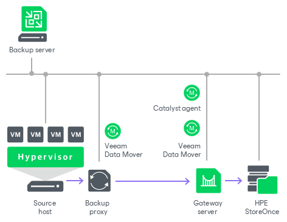

# HPE StoreOnce

In this article

You can use HPE StoreOnce storage systems with StoreOnce Catalyst as backup repositories.

To support Catalyst technology, Veeam Backup & Replication uses the following HPE StoreOnce components:

* HPE StoreOnce Catalyst library. The Catalyst library is included in the HPE StoreOnce Catalyst SDK. The HPE StoreOnce Catalyst SDK is installed automatically when you add a Microsoft Windows or Linux server to your backup infrastructure.
* HPE StoreOnce Catalyst server. The Catalyst server is a target-side component that runs on the OS of the HPE StoreOnce storage system.

Backup Infrastructure

To communicate with HPE StoreOnce, Veeam Backup & Replication uses two [Veeam Data Movers](veeam_transport_service.md) that are responsible for data processing and transfer:

* Veeam Data Mover on the VMware or off-host backup proxy
* Veeam Data Mover on the gateway server

The HPE StoreOnce storage cannot host Veeam Data Mover. For this reason, to communicate with the HPE StoreOnce storage, you need to deploy a gateway server. Veeam Backup & Replication will automatically deploy Veeam Data Mover on this gateway server. For more information, see [Gateway Servers](gateway_server.md).

When any job addresses the backup repository, Veeam Data Mover on the gateway server establishes a connection with Veeam Data Mover on the VMware or off-host backup proxy, enabling efficient data transfer over LAN or WAN.

The gateway server is selected when you assign a backup repository role to the HPE StoreOnce appliance. You can define the gateway server explicitly or instruct Veeam Backup & Replication to select it automatically.

Supported Protocols

Veeam Backup & Replication supports HPE StoreOnce storage systems working over the following protocols:

* TCP/IP protocol: Veeam Backup & Replication communicates with the HPE StoreOnce Catalyst server by sending commands over the LAN.
* Fibre Channel protocol: Veeam Backup & Replication communicates with the HPE StoreOnce Catalyst server by sending SCSI commands over Fibre Channel.

Data processing over Fibre Channel (FC) connectivity enables local area network-free backup to HP StoreOnce, eliminates the load from backup activities and increases availability of LAN resources to production workloads.

Considerations and Limitations for HPE StoreOnce

General

If you plan to use HPE StoreOnce as a backup repository for jobs other than file backup jobs, object storage backup jobs and Veeam Plug-In for Enterprise Application jobs, consider the following recommendations and limitations. These requirements and limitations apply only if you use HPE StoreOnce in the integration mode, not the shared folder mode.

* Check that HPE StoreOnce that you plan to use is supported. For more information, see [Backup Target](system_requirements.md#target).

* Check [requirements and limitations for the gateway server](gateway_server.md).

* The same Catalyst Store cannot be added to multiple backup servers.
* The user account used to connect to HPE StoreOnce must have permissions listed in [Permissions](required_permissions.md#rphost).
* Use of HPE StoreOnce with Catalyst does not guarantee the improvement of job performance. It can reduce the load on the network and improve the network throughput.
* Veeam Backup & Replication uses the Catalyst library installed on the gateway server when working with HPE StoreOnce. The gateway location affects the network load.

For backup operations, assign the gateway server role to a machine on the source side. Select a machine that is closer to the VMware backup proxy or to the off-host backup proxy to reduce network load between the source and target sides.

For restore operations, assign the gateway server role to a machine that is closer to the backup repository. The gateway server location as for backup will increase the network load during restore because Veeam Backup & Replication transfers uncompressed data from the gateway server during restore.

* If you connect to an HPE StoreOnce backup repository over Fibre Channel, you must explicitly define a gateway server to communicate with HPE StoreOnce. As a gateway server, you must use a Microsoft Windows or Linux server that has access to the HPE StoreOnce backup repository over Fibre Channel.
* When you create a backup job targeted at an HPE StoreOnce backup repository, Veeam Backup & Replication will offer you to switch to optimized job settings and use the 4 MB size of data block for workload data processing (the Storage optimization setting). It is recommended that you use optimized job settings. Large data blocks produce a smaller metadata table that requires less memory and CPU resources to process. For more information on storage optimization, see [Data Compression and Deduplication](compression_deduplication.md#optimization).

* The HPE StoreOnce backup repository usually works in the Use per-machine backup files mode. For more information, see [Backup Chain Formats](per_vm_backup_files.md). Note that there are cases when the HPE StoreOnce backup repository can store per-machine backups and non per-machine backups. For example, when backups are evacuated to this repository from other extents in a SOBR. For more information, see [Evacuating Backups from Performance Extents](sobr_evacuate.md). Note that restore from such backups can last longer than from per-machine backups.

* Do not enable encryption for the jobs targeted at the deduplication storage appliance. Encryption has a negative effect on the deduplication ratio. For more information, see [Data Encryption](encryption_job.md).

* HPE StoreOnce does not support the reverse incremental backup method.
* For backup jobs, HPE StoreOnce does not support the forever forward incremental backup method. When creating a backup job, you must enable synthetic or active full backups. For more information on how to enable such backups, see [Backup Settings](backup_job_advanced_backup_vm.md) in VMware vSphere backup jobs and [Backup Settings](backup_job_advanced_backup_hv.md) in Microsoft Hyper-V backup jobs.

* The HPE StoreOnce backup repository does not support the Defragment and compact full backup file option.

* If you target a backup copy job to an HPE StoreOnce repository or to a scale-out backup repository with an HPE StoreOnce extent, you must enable the [long-term retention](backup_copy_target.md) for this backup copy job.

* You cannot perform Quick Migration for Microsoft Hyper-V VMs started with Instant Recovery from the backup that resides in the HPE StoreOnce backup repository.
* You cannot use HPE StoreOnce backup repositories as sources or targets for file copy jobs.
* You cannot copy backup files (VBK, VIB and VRB) manually to the HPE StoreOnce backup repository. To copy such files, use backup copy jobs or [evacuate backups](sobr_evacuate.md) if you use a scale-out backup repository.
* You cannot use the HPE StoreOnce backup repository as a cloud repository hosted behind a Cloud Connect Gateway server.
* To optimize data transfer between two HPE StoreOnce repositories, use backup copy jobs for HPE StoreOnce repositories. For more information on how to create jobs and recommendations for them, see [Creating Backup Copy Jobs for HPE StoreOnce Repositories](backup_copy_hpe_storeonce.md).
* Veeam Backup & Replication supports HPE Cloud Bank Storage for HPE StoreOnce software version 4.3.2 or later. It can be used for a limited range of operations. For more information, see [HPE StoreOnce Supported Features](storeonce_supported_features.md#bank).
* The HPE StoreOnce Cloud Bank stores do not work with object-versioned buckets. Immutability for these stores is enforced by the HPE StoreOnce solution, not the Cloud Bank object storage. As a result, the object storage administrator can delete data stored in the object storage buckets. To mitigate this risk, see the HPE best practice documentation.
* Veeam Backup & Replication supports fixed block chunking functionality for HPE StoreOnce software version 4.3.2 or later. To be able to use this functionality in Veeam Backup & Replication, check that the [Align backup file data blocks](dsa_repository_repository.md) option is enabled in the repository settings.

For more information and recommendations on working with HPE StoreOnce, see [this Veeam KB article](https://www.veeam.com/kb1745).

HPE StoreOnce and Unstructured Data Backup

If you plan to use HPE StoreOnce storage appliances for [unstructured data backup](unstructured_data_backup.md), consider the following recommendations for optimal performance:

* A StoreOnce system can have multiple Catalyst stores, and large backup loads (exceeding 1PB) should be spread across more than one Catalyst store on the same StoreOnce system.
* Do not include Catalyst stores in a SOBR intended for unstructured data backups. This will reduce the global deduplication of the StoreOnce system.

HPE StoreOnce and Veeam Plug-Ins for Enterprise Applications

If you plan to use HPE StoreOnce as a backup repository for Veeam Plug-In for Oracle RMAN or Veeam Plug-In for SAP HANA, the total number of stored files (data and metadata) must not exceed 3,000,000 per Catalyst store. If necessary, multiple Catalyst stores may be created on the same StoreOnce system.

HPE StoreOnce and Immutability

If you plan to enable [immutability for the HPE StoreOnce deduplicating storage appliance](storeonce_supported_features.md), consider the following recommendations and limitations:

* HPE StoreOnce software version must be 4.3.2 or later.
* Dual Authorization must be enabled on HPE StoreOnce. For more information on Dual Authorization, see [HPE Support Center](https://support.hpe.com/hpesc/public/docDisplay?docId=sd00002325en_us&docLocale=en_US&page=GUID-929A7998-2585-455C-936D-6DB15B988ABE.html).
* Check that the Maximum ISV Controlled Data Retention setting in HPE StoreOnce is greater than each of the following settings configured in Veeam Backup & Replication:

* The immutability period (the [Make recent backups immutable for](dsa_repository_repository.md) setting).

* The long-term retention period (the [Keep certain full backups longer for archival purposes](backup_job_gfs_vm.md) setting in VMware vSphere backup jobs and the [Keep some periodic full backups longer for archival purposes](backup_job_gfs_hv.md) setting in Hyper-V backup jobs).

If a period configured in Veeam Backup & Replication is greater than the Maximum ISV Controlled Data Retention setting, Veeam Backup & Replication keeps backups immutable for the period configured in the Veeam Backup & Replication settings but resets the expiration of the backup immutability flag during each job run. While the actual number of days that the backup must be kept immutable is greater than Maximum ISV Controlled Data Retention, Veeam Backup & Replication sets the expiration period equal to Maximum ISV Controlled Data Retention.

* To use the immutability feature for regular backup copy jobs (without HPE Catalyst Copy), enable the GFS retention policy. For more information, see [Long-Term Retention Policy (GFS) for Backup Copy Jobs](backup_copy_gfs.md).

* [For unstructured data backups] The immutability lock period in HPE StoreOnce is set by the backup repository immutability settings. For an example of how this mechanism works, see Case 8 in the [Unstructured Data Backup Retention Scenarios](unstructured_data_backup_retention_scenarios.md#case_8) section.

* Immutability applies only if you use HPE StoreOnce in the integration mode, not the shared folder mode.
* Immutability is supported only for [forward incremental backup chains](forward_incremental_backup.md). Once a backup file becomes immutable, it can be merged or deleted only when the immutability time period expires.

HPE StoreOnce Immutability and Veeam Agents

For more information on how immutability works with Veeam Agents, see the [Backup to Deduplicating Storage Appliances](agents_deduplicating_storage.md) section in Veeam Agent Backup.

Several Backup Repositories on HPE StoreOnce

You can configure several backup repositories on one HPE StoreOnce appliance and associate them with different gateway servers.

Consider the following:

* If you configure several backup repositories on HPE StoreOnce and add them as extents to a scale-out backup repository, make sure that all backup files from one backup chain are stored on one extent. If backup files from one backup chain are stored to different extents, the performance of transformation processes will be lower. For more information about transformation performance, see [this Veeam blog post](https://www.veeam.com/blog/hp-storeonce-catalyst-integration-coming-in-v9.html).
* HPE StoreOnce has a limit on the number of opened files that applies to the whole appliance. Tasks targeted at different backup repositories on HPE StoreOnce and run in parallel will equally share this limit.
* For HPE StoreOnce working over Fibre Channel, there is a limitation on the number of connections from one host. If you connect several backup repositories to one gateway, backup repositories will compete for connections.

* Deduplication on HPE StoreOnce works within the limits of one object store.

* If your VMs contain similar data, it is recommended to create backup repositories on a single HPE StoreOnce Catalyst Store. This minimizes backup job duration and reduces disk space used for backups. For details, see [this Veeam KB article](https://www.veeam.com/kb2987).

Related Topics

* [Operational Modes](deduplicating_appliance_storeonce_modes.md)
* [HPE StoreOnce Supported Features](storeonce_supported_features.md)
* [Accelerated Restore of Entire VM](storeonce_accelerated_restore.md)
* [Adding Deduplicating Storage Appliances](dsa_repository_add.md)

Page updated 11/24/2025

Page content applies to build 13.0.1.1071
