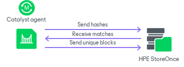
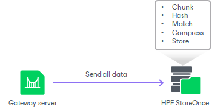

# Operational Modes

Depending on the storage configuration and type of the backup target, HPE StoreOnce can work in the following modes:

* [Source-side deduplication](#source)
* [Target-side deduplication](#target)
* [Shared folder mode](#shared)

Source-Side Data Deduplication

HPE StoreOnce performs source-side deduplication if the backup target meets the following requirements:

* You have a Catalyst license installed on HPE StoreOnce.
* You use a Catalyst store as a backup repository.
* The Catalyst store is configured to work in the Low Bandwidth mode (Primary Transfer Policy).
* The HPE StoreOnce Catalyst is added to the backup repository as a deduplicating storage appliance, not as a shared folder.

To deduplicate data on the source side, HPE StoreOnce uses the HPE StoreOnce Catalyst library. The HPE StoreOnce Catalyst library is a component of the HPE StoreOnce Catalyst software. It is installed on the gateway server communicating with the HPE StoreOnce appliance.

HPE StoreOnce deduplicates data on the source side, before writing it to target:

1. During the backup job session, HPE StoreOnce analyzes data incoming to the HPE StoreOnce appliance in chunks and computes a hash value for every data chunk. Hash values are stored in an index on disk.
2. The HPE StoreOnce Catalyst library agent calculates hash values for data chunks in a new data flow and sends these hash values to target.
3. HPE StoreOnce identifies which data blocks are already saved on disk and communicates this information to the HPE StoreOnce Catalyst library. The HPE StoreOnce Catalyst library sends only unique data blocks to target.

As a result, the load on the network reduces, the backup job performance improves, and you can save on disk space.

Target-Side Data Deduplication

HPE StoreOnce performs target-side deduplication if the backup target is configured in the following way:

* For a Catalyst store:

+ The Catalyst store works in the High Bandwidth mode (Primary Transfer Policy is set to High Bandwidth).
+ The Catalyst license is installed on the HPE StoreOnce (required).
+ The Catalyst store is added to the backup repository as a deduplicating storage appliance, not as a shared folder.

* For an SMB (CIFS) store:

+ The Catalyst license is not required.
+ The SMB (CIFS) store is added as a shared folder backup repository to the backup infrastructure.

For more information about working with SMB (CIFS) stores, see [Shared Folder Mode](deduplicating_appliance_storeonce.md#shared).

HPE StoreOnce deduplicates data on the target side, after the data is transported to HPE StoreOnce:

1. HPE StoreOnce analyzes data incoming to the HPE StoreOnce appliance in chunks and creates a hash value for every data chunk. Hash values are stored in an index on the target side.
2. HPE StoreOnce analyzes VM data transported to target and replaces identical data chunks with references to data chunks that are already saved on disk.

As a result, only new data chunks are written to disk, which helps save on disk space.

Shared Folder Mode

If you do not have an HPE StoreOnce Catalyst license, you can add the HPE StoreOnce appliance as a shared folder backup repository. In this mode, HPE StoreOnce will perform target-side deduplication.

If you work with HPE StoreOnce in the shared folder mode, the performance of backup jobs and transformation processes is usually lower (in comparison with the integration mode, when HPE StoreOnce is added as a deduplicating storage appliance).

Related Topics

* [HPE StoreOnce](deduplicating_appliance_storeonce.md)
* [HPE StoreOnce Supported Features](storeonce_supported_features.md)
* [Adding Deduplicating Storage Appliances](dsa_repository_add.md)

