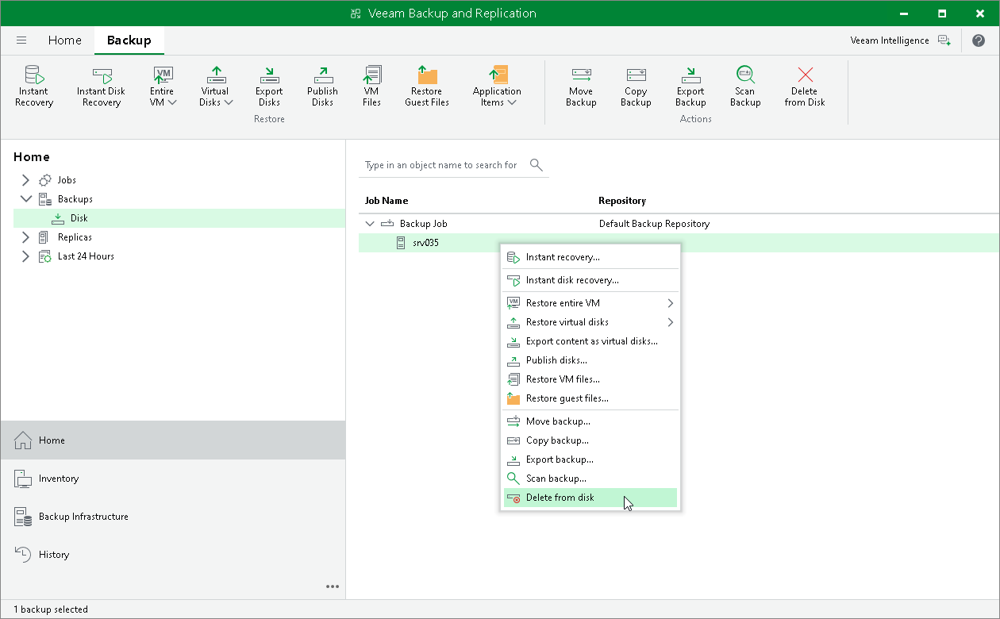

# Deleting Backups from Disk

The Delete from disk operation is needed if you want to remove records about backups from the Veeam Backup & Replication console and configuration database. This option allows you to delete the following type of data:

* [Backup files from the backup repository](#backups)
* [Separate VMs from backups](#deletevm)

When you delete backup files from a disk, Veeam Backup & Replication deletes the whole chain from the backup repository. Thus, on the next backup job run, Veeam Backup & Replication will create full backups for VMs included in the job.

Consider the following:

* Do not delete backup files from the backup repository manually. Use the Delete from disk option instead. If you delete backup files manually, subsequent backup or replication job sessions will fail.

* If the per-machine functionality is enabled, you can perform the Delete from disk operation for separate VMs in the backup. If you delete backup files for one VM, on the next run of the backup job Veeam Backup & Replication will create a full backup for VMs whose backup files are deleted. For all other VMs, Veeam Backup & Replication will create increments.

To learn more about per-machine backup files, see [Backup Chain Formats](per_vm_backup_files_hv.md).

* When you delete a separate VMs from a backup and if the [per-machine](per_vm_backup_files_hv.md) functionality is enabled for this VM, Veeam Backup & Replication behaves differently:

* [If per-machine is enabled] Veeam Backup & Replication deletes backup files of the selected VMs.

On the next run of the job, Veeam Backup & Replication will create full backups for VMs whose backup files were deleted. For all other VMs, Veeam Backup & Replication will create increments.

* [If per-machine is disabled] Veeam Backup & Replication only marks data blocks that belong to the deleted VMs as empty — the size of backup files does not change. However, Veeam Backup & Replication will use these data blocks during such operations as merging backup files. To reduce the size of full backup files in forever forward incremental and reverse incremental backup chains, you can [compact full backup files](backup_compact_file_hv.md). In forward incremental backup chains, files with blocks marked as empty will be deleted by retention.

On the next run of the job, Veeam Backup & Replication will create full backups for VMs whose backup files were deleted. Note that full backups of these VMs will be stored in an incremental file. For all other VMs, Veeam Backup & Replication will create incremental backups.

* If you use the scale-out backup repository, keep in mind that the Delete from disk operation will remove the backups not only from the performance tier but also from the capacity and archive tier. If you want to remove backups from the performance tier only, you should move those backups to the capacity tier instead. For details, see [Manually Moving Backups to Capacity Tier](moving_to_capacity_tier.md).

Deleting Backups

To delete backup files from the backup repository, do the following:

1. Open the Home view.

1. In the [inventory pane](vbr_ui.md), select Backups or Replicas.

1. In the working area, select the backup and click Delete from > Disk on the ribbon. You can also right-click the backup and select Delete from disk.

1. To remove backups with GFS flags (weekly, monthly and yearly), select the Remove GFS full backups check box and click Yes.

Deleting VMs from Backups

To delete a VM from a backup, do the following:

1. Open the Home view.

1. In the inventory pane, select Backups or Replicas.

1. In the working area, expand the necessary backup, select the VM you want to delete and click Delete from > Disk on the ribbon. You can also right-click the backup and select Delete from disk.

1. To remove backups with GFS flags (weekly, monthly and yearly), select the Remove GFS full backups check box and click Yes.

