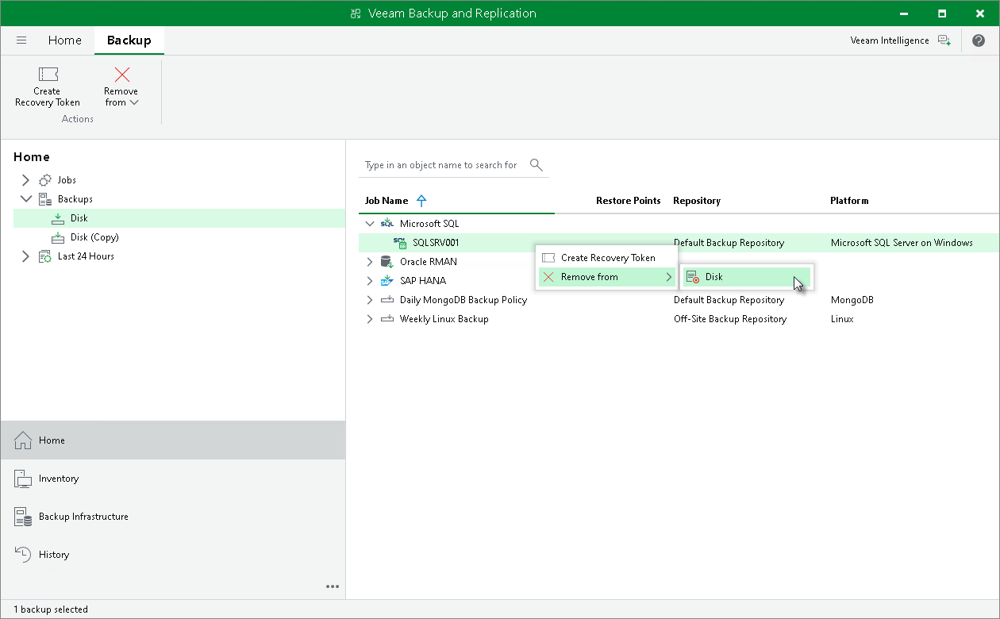

# Deleting Backup

In this article

You can use the Veeam Backup & Replication console to delete backups created with Veeam Plug-In for Microsoft SQL Server from a Veeam backup repository.

To delete a backup, do the following:

1. In the Veeam Backup & Replication console, open the Home view.
2. In the inventory pane, select Backups.
3. In the working area, right-click the name of the backed-up object and select Remove from > Disk.

Page updated 8/29/2025

Page content applies to build 13.0.1.1071
