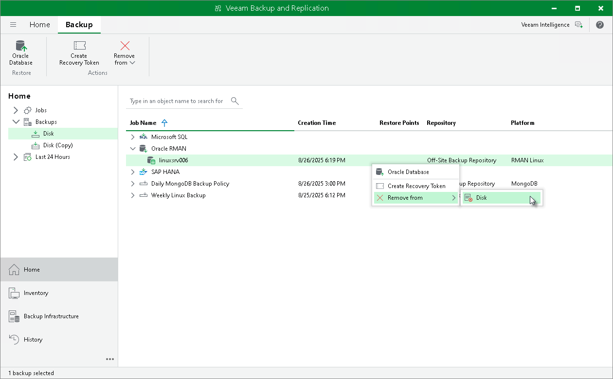

# Deleting Backups Manually

In this article

If you want to delete backups files, you can use the Oracle RMAN housekeeping functionality. For details, see [this Oracle article](https://docs.oracle.com/cd/E11882_01/backup.112/e10642/rcmmaint.htm#BRADV8172).

If you have lost the recovery catalog, you can remove the backups manually from a Veeam backup repository.

|  |
| --- |
| Important |
| If you remove backups from a Veeam backup repository manually, the metadata about these backups is NOT deleted from the recovery catalog. Thus, if you have a recovery catalog, it is not recommended to manually delete backup files. Otherwise, the recovery catalog will remain in the outdated state. |

To remove a backup from Veeam backups repository, do the following:

1. In the Veeam Backup & Replication console, open the Home view.
2. In the Inventory pane, select Backups.
3. In the working area, right-click the backup job object name and select Delete from disk.

Page updated 11/28/2024

Page content applies to build 13.0.1.1071
