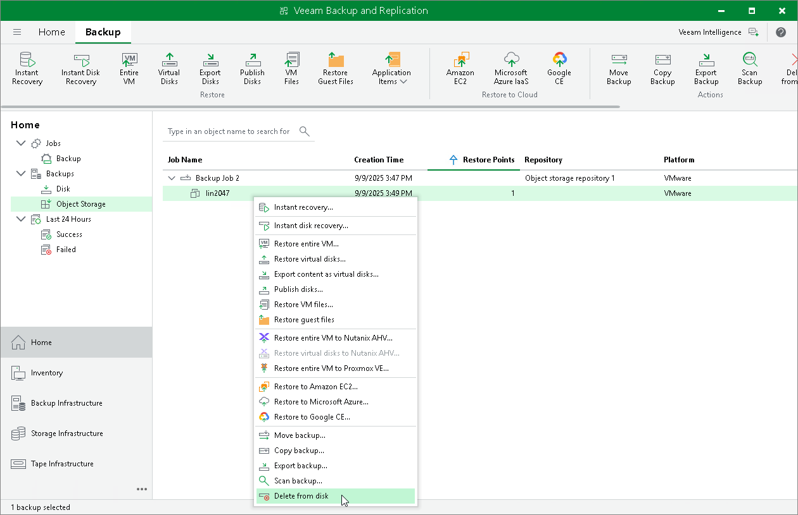

# Deleting Backups from Object Storage Repositories

This section describes how to delete backups from object storage repositories. To know how to delete backups from an object storage repository added as an extent of the scale-out backup repository, see [Deleting Backups from Scale-Out Backup Repositories](deleting_backups_from_sobr.md).

To delete a backup from object storage repositories, do the following:

1. Open the Home view.
2. In the inventory pane, navigate to the Backups > Object Storage node.
3. In the working area, select a backup or VM and click Delete from Disk on the ribbon. Alternatively, you can right-click a backup and select Delete from disk.

