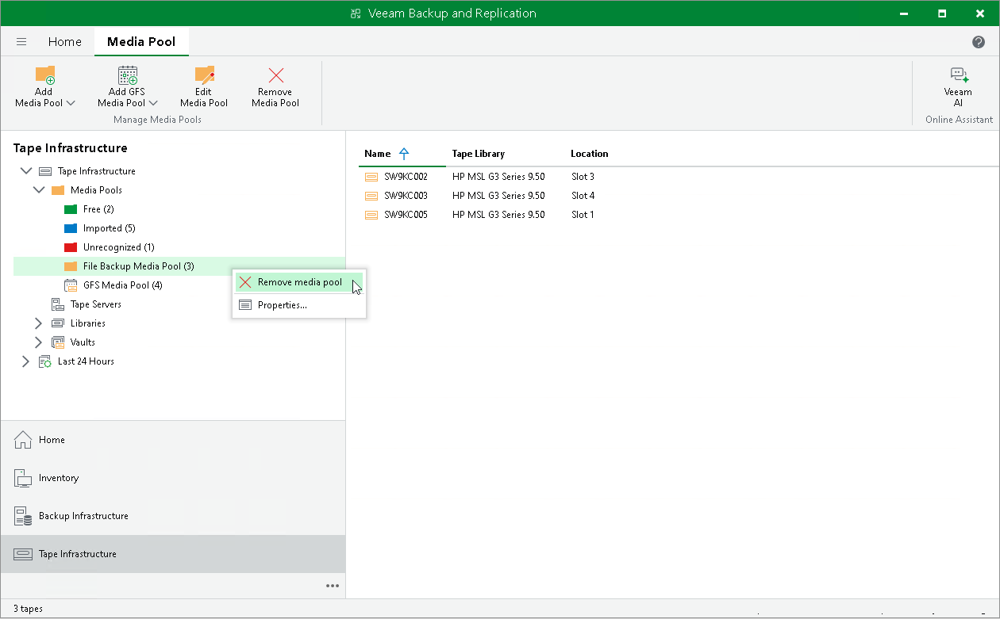

# Removing Media Pools

In this article

If you no longer need a media pool or a GFS media pool, you can remove it:

1. Open the Tape Infrastructure view.
2. Navigate to the Media Pool node.
3. Right-click the necessary media pool and choose Remove Media Pool from the shortcut menu. Alternatively, select a media pool and click Remove Media Pool on the ribbon.
4. In the displayed dialog box, click OK to confirm deletion.

When you remove a media pool, its tapes are moved to the Imported media pool. The data on the tapes is not erased. You can use the tapes in the Imported media pool for restore operations.

The Imported media pool does not have any retention settings. The tapes in the Imported media pool are never overwritten as they are not used by any jobs. The media set number and the media set expiration date are inherited and remain for user information. The data will remain on tapes until you choose to erase it manually.

If you do not need the data on tapes, you can move the imported tapes to the Free media pool or any other media pool. In this case, the tapes will be marked as free. For more information, see [Moving Tapes to Another Media Pool](moving_tapes_to_custom_pool.md).

Limitations for Removing Media Pools

* You can remove only regular media pools or GFS media pools; service media pools cannot be removed.
* You cannot remove a media pool that is used in a backup to tape or file to tape job. To remove such media pool, you need to point the jobs to other media pools or GFS media pools.

Page updated 7/10/2023

Page content applies to build 13.0.1.1071
