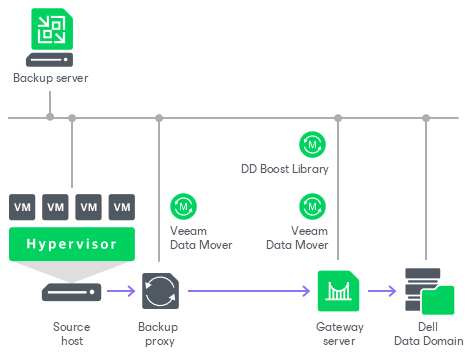

# Dell Data Domain

You can use Dell Data Domain storage systems with Data Domain Boost (DD Boost) as backup repositories.

To support the DD Boost technology, Veeam Backup & Replication uses the following Dell Data Domain components:

* DD Boost library. The DD Boost library is included in the Dell Data Domain DDBoost SDK. The Dell Data Domain DDBoost SDK is installed automatically when you add a Microsoft Windows or Linux server to your backup infrastructure.
* DD Boost server. The DD Boost server is a target-side component. The DD Boost server runs on the OS of the Dell Data Domain storage system.

Backup Infrastructure

To communicate with Dell Data Domain, Veeam Backup & Replication uses two [Veeam Data Movers](veeam_transport_service.md) that are responsible for data processing and transfer:

* Veeam Data Mover on the backup proxy
* Veeam Data Mover on the gateway server

The Dell Data Domain storage cannot host Veeam Data Mover. For this reason, to communicate with the Dell Data Domain storage, you need to deploy a gateway server. Veeam Backup & Replication will automatically deploy Veeam Data Mover on this gateway server. For more information, see [Gateway Servers](gateway_server.md).

When any job addresses the backup repository, Veeam Data Mover on the gateway server establishes a connection with Veeam Data Mover on the backup proxy.

You define what gateway server to use when you assign a backup repository role to Dell Data Domain. You can define the gateway server explicitly or instruct Veeam Backup & Replication to select it automatically.

Supported Protocols

Veeam Backup & Replication supports Dell Data Domain storage systems working over the following protocols:

* TCP/IP protocol: Veeam Backup & Replication communicates with the Dell Data Domain server by sending commands over the network.
* Fibre Channel protocol: Veeam Backup & Replication communicates with the Dell Data Domain Fibre Channel server by sending SCSI commands over Fibre Channel.

Considerations and Limitations for Dell Data Domain

General

If you plan to use Dell Data Domain as a backup repository, consider the following:

* We strongly recommend that you follow recommendations from this list and also recommendations from [this Veeam KB article](https://www.veeam.com/kb1745).
* Check [requirements and limitations for the gateway server](gateway_server.md).
* The same Data Domain Boost storage unit cannot be added to multiple backup servers.

* The user account used to connect to Dell Data Domain must have permissions listed in [Permissions](required_permissions.md#rphost).

* Veeam Backup & Replication uses the DD Boost library installed on the gateway server when working with Dell Data Domain. The gateway location affects the network load.

For backup operations, assign the gateway server role to a machine on the source side. Select a machine that is closer to the VMware backup proxy or to the off-host backup proxy to reduce network load between the source and target sides.

For restore operations, assign the gateway server role to a machine that is closer to the backup repository. The gateway server location as for backup will increase the network load during restore because Veeam Backup & Replication transfers uncompressed data from the gateway server during restore.

* Use of Dell Data Domain with DD Boost does not guarantee improvement of job performance. It can reduce the load on the network and improves the network throughput.
* NFSv3 service must be enabled on Dell Data Domain. Otherwise, Veeam Backup & Replication will not be able to access the storage system.
* Do not enable encryption for the jobs targeted at the deduplication storage appliance. Encryption has a negative effect on the deduplication ratio. For more information, see [Job Encryption](encryption_job.md).

Encryption can also affect the backup size: the size of a backup can be larger than the size of the original VM. When you enable encryption, set [data processing block size to 4 MB](compression_deduplication.md#optimization), and leave [decompression on target and block alignment](dsa_repository_repository.md) enabled (enabled by default), the size of the backup increases by 1 MB for each 4 MB data block. This is because Veeam Backup & Replication reads blocks of 4 MB, encrypts them, adds 16 KB metadata to each data block and then aligns data blocks. This results in that each 4 MB data block on the source becomes 5 MB block on the target.

* When you create a backup job targeted at an Dell Data Domain backup repository, Veeam Backup & Replication will offer you to switch to optimized job settings and use the 4 MB size of data block for workload data processing (the Storage optimization setting). It is recommended that you use optimized job settings. Large data blocks produce a smaller metadata table that requires less memory and CPU resources to process. For more information on storage optimization, see [Data Compression and Deduplication](compression_deduplication.md#optimization).
* Dell Data Domain does not support the reverse incremental backup method.
* You cannot use Dell Data Domain backup repositories as sources or targets for file copy jobs.

* The [forever forward backup chains](backup_methods.md) are not supported. The length of [forward incremental backup chain](backup_methods.md) cannot be greater than 120 restore points. To overcome this limitation, schedule full backups (active or synthetic) to split the backup chain into shorter series. For example, to perform backups at 15-minute intervals 24 hours a day, you must schedule synthetic fulls every day. In this scenario, intervals immediately after midnight may be skipped due to duration of synthetic processing. For more information, see [How Synthetic Full Backup Works](synthetic_full_hiw.md).
* If you target a backup copy job to a Dell Data Domain repository or to a scale-out backup repository with a Dell Data Domain extent, you must enable the [long-term retention](backup_copy_target.md) for this backup copy job.
* If you connect to an Dell Data Domain backup repository over Fibre Channel, you must explicitly define a gateway server to communicate with Dell Data Domain. As a gateway server, you must use a Microsoft Windows or Linux server that is added to the backup infrastructure and has access to the Dell Data Domain backup repository over Fibre Channel.

* During backup repository rescan, Veeam Backup & Replication detects if the hard stream limit is set for a storage unit, and displays this information in backup repository rescan statistics. If the hard stream limit is exceeded when Veeam Backup & Replication runs tasks against the backup repository, Veeam Backup & Replication will fail to create new I/O streams.

Immutability

If you plan to enable [immutability for the Dell Data Domain deduplicating storage appliance](dell_dd_supported_features.md#lock), consider the following recommendations and limitations:

* By default, Veeam Backup & Replication supports only the compliance mode of Dell Data Domain retention lock. For more information on retention lock, see [Dell Technologies Article](https://www.dell.com/support/kbdoc/en-us/000079803/data-domain-retention-lock-frequently-asked-questions-faq). You can use the governance mode by setting the value in the configuration file on the Linux-based backup server or with registry values on the Microsoft Windows-based backup server. For more information, see [this Veeam KB article](https://www.veeam.com/kb4805).
* Automatic retention lock must be disabled.

* The duration of the immutability period (the [Make recent backups immutable](dsa_repository_repository.md) setting) as well as the duration of the long-term retention period (the [Keep certain full backups longer for archival purposes](backup_job_gfs_vm.md) setting in VMware vSphere backup jobs and the [Keep some periodic full backups longer for archival purposes](backup_job_gfs_hv.md) setting in Hyper-V backup jobs) configured in Veeam Backup & Replication must lie in the range between the minimum and maximum retention periods configured in Dell Data Domain. The minimum and maximum values are included into the range.

If the immutability period configured in Veeam Backup & Replication lies outside the range configured in Dell Data Domain, Veeam Backup & Replication does not allow you to proceed to the next step until the value is changed.

If the long-term retention period configured in Veeam Backup & Replication is greater than the maximum retention period configured in Dell Data Domain, Veeam Backup & Replication keeps backups immutable for the period configured in the Veeam Backup & Replication settings but resets the expiration of the backup immutability flag during each job run. While the actual number of days that the backup must be kept immutable is greater than the maximum, Veeam Backup & Replication sets the expiration period equal to the maximum.

If some operations, for example, evacuate or move, try to set the immutability period less than the minimum period configured in Dell Data Domain, Veeam Backup & Replication sets the expiration period for the immutability flag equal to the minimum retention period.

* [For unstructured data backups] The immutability lock period in Dell Data Domain is set by the backup repository immutability settings. For an example of how this mechanism works, see Case 8 in the [Unstructured Data Backup Retention Scenarios](unstructured_data_backup_retention_scenarios.md#case_8) section.
* Immutability is supported only for [forward incremental backup chains](forward_incremental_backup.md). Once a backup file becomes immutable, it can be merged or deleted only when the immutability time period expires.

* To use the immutability feature for backup copy jobs, enable the GFS retention policy. For more information, see [Long-Term Retention Policy (GFS) for Backup Copy Jobs](backup_copy_gfs.md).

Dell Data Domain Immutability and Veeam Agents

For more information on how immutability works with Veeam Agents, see the [Backup to Deduplicating Storage Appliances](agents_deduplicating_storage.md) section in Veeam Agent Backup.

Related Topics

* [Dell Data Domain Supported Features](dell_dd_supported_features.md)
* [Accelerated Restore of Entire VM](dell_dd_accelerated_restore.md)
* [Adding Deduplicating Storage Appliances](dsa_repository_add.md)

