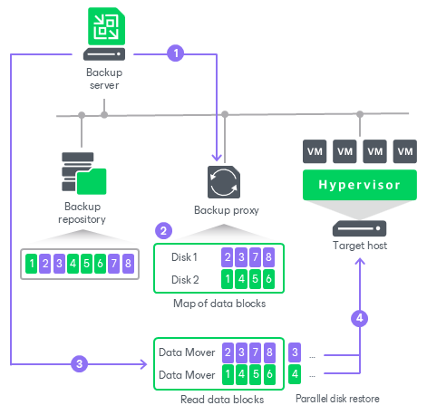

# Accelerated Restore

To speed up entire VM restore and [Restore to Microsoft Azure](restore_azure.md) from Dell Data Domain, Veeam Backup & Replication uses the mechanism of sequential data reading from backups and parallel VM disks restore.

Dell Data Domain storage systems are optimized for sequential I/O operations. However, data blocks of VM disks in backup files are stored not sequentially, but in the random order. If data blocks of VM disks are read at random, the restore performance from backups on Dell Data Domain degrades.

To accelerate the restore process, Veeam Backup & Replication creates a map of data blocks in backup files. It uses the created map to read data blocks of VM disks from backup files sequentially, as they reside on disk. Veeam Backup & Replication writes data blocks to target in the order in which they come from the target [Veeam Data Mover](veeam_transport_service.md), restoring several VM disks in parallel.

This accelerated restore mechanism is enabled by default, and is used for the entire VM restore and restore to Microsoft Azure scenarios.

|  |
| --- |
| Note |
| To further accelerate the process of entire VM restore and restore to Microsoft Azure, Veeam Backup & Replication reads VM data from Dell Data Domain in multiple threads. |

How Accelerated Restore Works

Restore from backups on Dell Data Domain is performed in the following way:

1. Veeam Backup & Replication opens all backup files in the backup chain, reads metadata from these backup files and caches this metadata on the backup proxy that is assigned for the restore task.
2. Veeam Backup & Replication uses the cached metadata to build a map of data blocks. The map contains references to VM data blocks, sorted by VM disks.
3. Every VM disk is processed in a separate task. For each task, Veeam Backup & Replication starts one Veeam Data Mover on the backup proxy. Additionaly, Veeam Backup & Replication starts Data Mover on the gateway server, but one Veeam Data Mover for all tasks.

Veeam Data Mover on the gateway server reads data blocks of VM disks from the backup repository sequentially, as these blocks reside on disk. Then Veeam Data Mover on the gateway server transfers data blocks to Data Movers on the backup proxy. On the backup proxy, these data blocks are put to the buffer.

1. Data blocks are written to target in the order in which they come from the target Veeam Data Mover.

Backup Proxy for Accelerated Restore

Veeam Backup & Replication restores all disks of a VM through one backup proxy. In Microsoft Hyper-V environments, the role of a backup proxy is assigned to the target Microsoft Hyper-V host — host to which the VM is restored. In VMware vSphere environments, if you instruct Veeam Backup & Replication to select a backup proxy for the restore task automatically, it picks the least loaded backup proxy in the backup infrastructure. If you assign a backup proxy explicitly, Veeam Backup & Replication uses the selected backup proxy.

For every VM disk, Veeam Backup & Replication starts a separate Veeam Data Mover on the backup proxy. For example, if you restore a VM with 10 disks, Veeam Backup & Replication starts 10 Veeam Data Movers on the backup proxy.

The backup proxy assigned for the restore task must have enough RAM resources to be able to restore VM disks in parallel. For every VM disk, 200 MB of RAM is required. The total amount of required RAM resources is calculated by the following formula:

|  |
| --- |
| Total amount of RAM = Number of VM disks \* 200 MB |

Before starting the restore process, Veeam Backup & Replication checks the amount of RAM resources on the backup proxy. If the backup proxy does not have enough RAM resources, Veeam Backup & Replication displays a warning in the job session details and automatically fails over to a regular VM disks processing mode (data of VM disks is read at random and VM disks are restored sequentially).

Limitations for Accelerated Restore

The accelerated restore of entire VMs and restore to Microsoft Azure have the following limitations:

* Accelerated restore works on Dell Data Domain systems with DD Boost.
* If you restore a VM with dynamically expanding disks, the restore process may be slow.
* [For VMware vSphere environments] If you restore a VM using the Network transport mode, the number of VM disks restored in parallel cannot exceed the number of allowed connections to an ESXi host.
* If Dell Data Domain is added as an extent to a scale-out backup repository, you must set the backup file placement policy to Locality. If the backup file placement policy is set to Performance, parallel VM disk restore will be disabled.

Related Topics

* [Dell Data Domain](dell_dd.md)
* [Dell Data Domain Supported Features](dell_dd_supported_features.md)
* [Adding Deduplicating Storage Appliances](dsa_repository_add.md)

