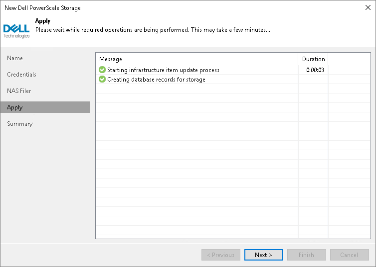

# Step 5. Apply Settings

In this article

At the Apply step of the wizard, wait for the storage system to be added to the backup infrastructure. After that, click Next.

Page updated 8/10/2023

Page content applies to build 13.0.1.1071
