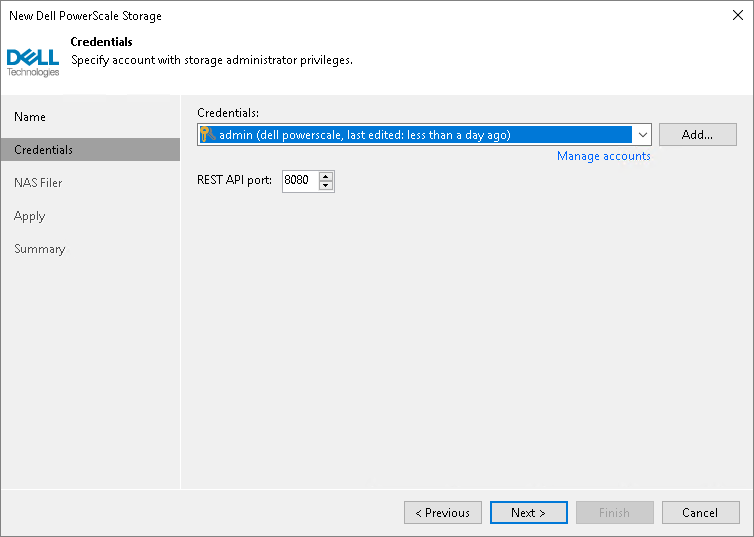

# Step 3. Specify Credentials

At the Credentials step of the wizard, specify credentials for a user account with administrator privileges on the storage system: from the Credentials drop-down list, select credentials to connect to the storage system. If you have not set up credentials beforehand, click the Manage accounts link or click Add on the right of the Credentials field to add the credentials. For more information, see the [Credentials Manager](credentials_manager.md) section in the Veeam Backup & Replication User Guide.

If the certificate installed on the server is not trusted, Veeam Backup & Replication displays a warning.

* To view detailed information about the certificate, click View.
* If you trust the server, click Continue.
* If you do not trust the server, click Cancel.

Veeam Backup & Replication will display an error message, and you will not be able to connect to the server.

In the REST API port dialog box, select the necessary port.

