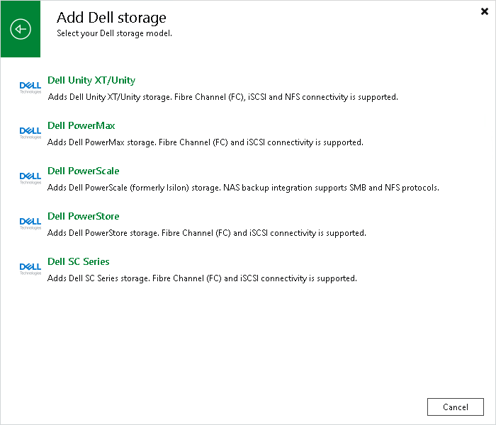

# Step 1. Launch New Dell Unity Storage Wizard

To launch the wizard for adding a storage system, do the following:

1. Open the Storage Infrastructure view.
2. In the working area, click Add Storage. Alternatively, you can right-click the Storage Infrastructure node and select Add Storage.
3. In the displayed window, click Dell Technologies.
4. In the Add Dell storage window, select Dell Unity XT/Unity.

|  |
| --- |
| Tip |
| If you have at least one Dell storage system in the backup infrastructure, you can select the <Dell storage model name> node in the inventory pane, right-click anywhere in the working area and select Add storage. |

