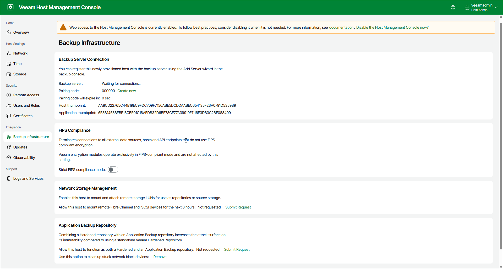
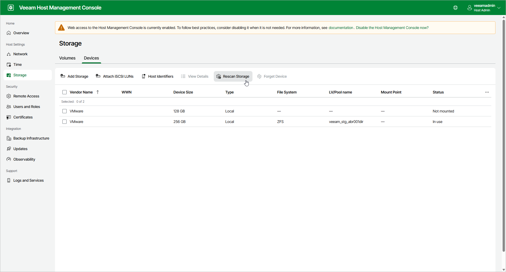
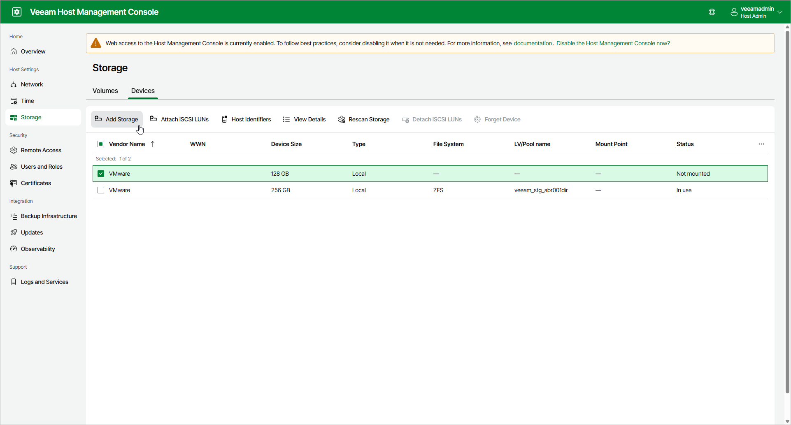

# Deploying Application Backup Repository

An application backup repository is based on a hardened repository deployed from the Veeam Infrastructure Appliance ISO file. You can configure and maintain an application backup repository using Veeam Infrastructure Appliance configuration management.

Before you configure an application backup repository with Veeam Infrastructure Appliance, check the [system requirements](system_requirements_abr.md) and [limitations](abr_limitations.md). Then, perform the following steps:

1. To deploy Veeam Hardened Repository, follow the steps described in [Installing Veeam Infrastructure Appliance with ISO](linux_infrastructure_appliance_install.md). In the Veeam Infrastructure Appliance installation menu, select the Veeam Hardened Repository option.

After the initial configuration and installation are finished, general information about the server will be displayed.

1. Using the server information from Step 1, log in to the Veeam Host Management web UI as a Host Administrator. For details, see [Accessing Veeam Host Management Console](hmc_access.md).
2. In the management pane, click Backup Infrastructure.
3. In the Application Backup Repository section, click Submit Request next to Allow this host to function as both a Hardened and an Application Backup repository. The NFS services included in the application backup repository increase the host attack surface, so the Security Officer's approval is required for this operation:

* If the Security Officer account is configured, the application backup repository will be enabled after the Security Officer approves the request.
* If the Security Officer account is not configured, the application backup repository will be enabled instantly.

1. Add a new local disk of any capacity to the hardened repository server. The disk will be used as an application backup repository. If you add multiple disks, they can be joined into a single storage pool for an application backup repository.

|  |
| --- |
| Important |
| Remote iSCSI or Fibre Channel disks are not supported. |

1. In the management pane, click Storage.
2. Open the Devices tab and click Rescan Storage. The disk or disks added in Step 5 will be added to the list of devices.

1. In the working area, select the new device or devices and click Add Storage to open the Add Storage wizard.

1. Follow the steps of the Add Storage wizard. For more information, see [Adding Storage](https://helpcenter.veeam.com/docs/vbr/userguide/hmc_manage_storage.html#adding-storage).
2. Add the Veeam Infrastructure Appliance component to Veeam Backup & Replication as a managed server. For more information on adding Veeam Infrastructure Appliance components, see [Adding Veeam Infrastructure Appliance](adding_via.md).

Page updated 2026-07-29

