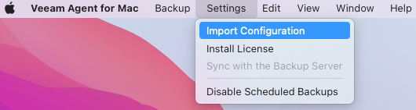
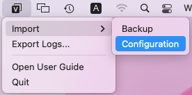

# Deploying Veeam Agent for Mac Using Generated Setup Files

To install or upgrade Veeam Agent for Mac on a computer added to a protection group for pre-installed Veeam Agents, you must perform the following operations:

1. [Install](#install) or [upgrade](#upgrade) Veeam Agent using the setup files generated by Veeam Backup & Replication.
2. [Apply the protection group configuration to Veeam Agent](#configure).

|  |
| --- |
| NOTE |
| For automation purposes, you may also want to use the following installation and configuration options:   * [Installing and Configuring Veeam Agent for Mac in Command Line Interface](agents_vam_install_cli.md)  * [Installing and Configuring Veeam Agent for Mac with MDM Solution](agents_vam_install_mdm.md) |

|  |
| --- |
| TIP |
| You can also find detailed instructions on deploying Veeam Agent in the readme file included in the setup file set generated by Veeam Backup & Replication. |

Installing Veeam Agent for Mac

To install Veeam Agent for Mac, do the following:

1. Upload the Veeam Agent setup files to the computer you want to protect.

You must use the setup files that were generated by Veeam Backup & Replication. To learn more about generating Veeam Agent setup files, see [Specifying Packages](protection_group_packages.md).

1. Navigate to the directory where you have saved the installation package and double-click the Veeam Agent for Mac-13.0.1.402.pkg to launch the installation wizard.
2. Follow the installation instructions.

|  |
| --- |
| NOTE |
| During the installation process, you must accept the following license agreements:   * Veeam End User License Agreement  * 3rd Party Components License Agreements |

1. After the installation process is complete, grant full disk access to Veeam Agent.

Upgrading Veeam Agent for Mac

After an upgrade of Veeam Backup & Replication, Veeam Agent for Mac on the computers in protection groups for pre-installed Veeam Agents may become outdated. To manually upgrade Veeam Agent for Mac on such computers, do the following:

1. In the Edit Protection Group wizard, regenerate the setup files to get the latest version of Veeam Agent. For more information, see [Editing Protection Group Settings](agents_protection_group_edit.md).
2. Upload the Veeam Agent setup files generated by Veeam Backup & Replication to the computer you want to protect.
3. Install the latest version of Veeam Agent as described in the [Installing Veeam Agent for Mac](#install) section.

Applying Protection Group Configuration to Veeam Agent for Mac

To manage Veeam Agent for Mac through a protection group for pre-installed Veeam Agents, you must import and apply the protection group configuration settings to Veeam Agent.

You can import the configuration file generated by Veeam Backup & Replication in ether of the following ways:

* [Using Veeam Agent control panel](#cp).
* [Using Veeam Agent status bar menu](#sbm).

Importing Configuration with Control Panel

From the Veeam Agent application menu, select Settings > Import Configuration; in the Finder, select the configuration file to import.

Importing Configuration with Status Bar Menu

From the Veeam Agent status bar menu, select Import > Configuration; in the Finder, select the configuration file to import.

After importing the configuration using the control panel or status bar menu, Veeam Agent will automatically connect to the Veeam backup server.

