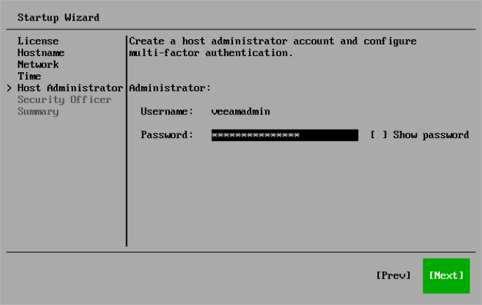
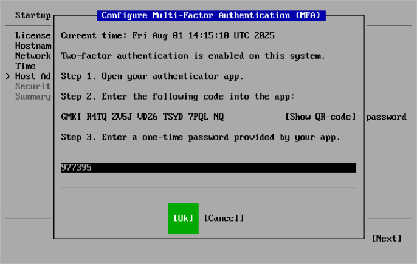

# Step 8. Configure Host Administrator Account

At the Host Administrator step of the Initial Configuration wizard, configure the default host administrator account to perform administrator activities in the Host Management console — veeamadmin. For more information about operations available for this role, see [Managing Users and Roles](hmc_users.md).

To configure the host administrator account, perform the following steps:

1. In the Password field, specify the password for the veeamadmin user. The password must comply with the following requirements:

* 15 characters minimum.
* 1 upper case character.
* 1 lower case character.
* 1 numeric character.
* 1 special character.
* No more than 4 characters of the same class in a row. For example, more than 4 lowercase or 4 numerical characters in sequence.

|  |
| --- |
| Tip |
| To view the password, select Show Password and press the spacebar. |

1. Configure multi-factor authentication (MFA):

1. Open your authentication application. Enter the code or scan the QR code.
2. Specify the one-time code provided by the application.
3. Press [Ok].

|  |
| --- |
| Note |
| Multi-factor authentication is compatible with mobile authentication applications that support [RFC4226](https://www.ietf.org/rfc/rfc4226.txt) and [RFC6238](https://datatracker.ietf.org/doc/html/rfc6238). |

1. Select Next.

