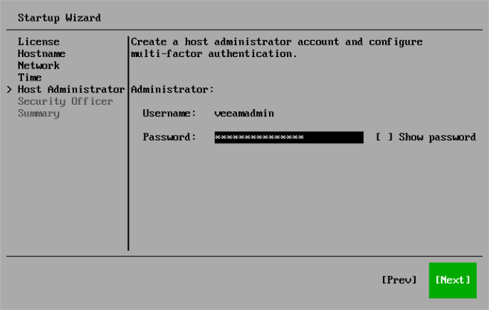
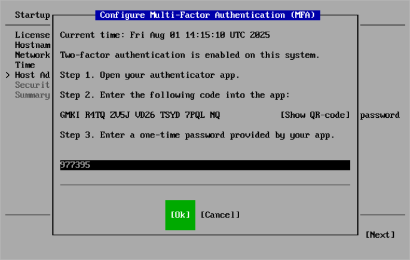

# Step 8. Configure Host Administrator Account

At the Host Administrator step of the Initial Configuration wizard, configure the default host administrator account to perform administrator activities in the Host Management console — veeamadmin. For more information about operations available for this role, see [Managing Users and Roles](hmc_users.md).

To configure the host administrator account, perform the following steps:

1. In the Password field, specify the password for the veeamadmin user. The password must comply with the following requirements:

* 15 characters minimum.
* 1 upper case character.
* 1 lower case character.
* 1 numeric character.
* 1 special character.
* No more than 4 characters of the same class in a row. For example, more than 4 lowercase or 4 numerical characters in sequence.

|  |
| --- |
| Tip |
| To view the password, select Show Password and press the spacebar. |

1. Configure your multi-factor authentication (MFA) settings. Perform one of the following actions:

1. To configure MFA immediately:

1. Open your authentication application. Enter the code or scan the QR code.
2. Specify the one-time code provided by the application in the Configure Multi-Factor Authentication dialogue box.
3. Press [OK].

1. To configure MFA in the Host Management console after completing the Initial Configuration wizard:

1. When the Configure Multi-Factor Authentication dialogue box opens, press [Escape].
2. Select [OK].

1. To disable MFA entirely:

1. Press [F8].
2. Type OK in the field.

|  |
| --- |
| Important |
| If you disable MFA in the Initial Configuration wizard, you can enable it later in the Host Management console. After you enable MFA, users are prompted to set it up at their next login. |

|  |
| --- |
| Note |
| Multi-factor authentication is compatible with mobile authentication applications that support [RFC4226](https://www.ietf.org/rfc/rfc4226.txt) and [RFC6238](https://datatracker.ietf.org/doc/html/rfc6238). |

1. Select Next.

Page updated 2026-06-23

