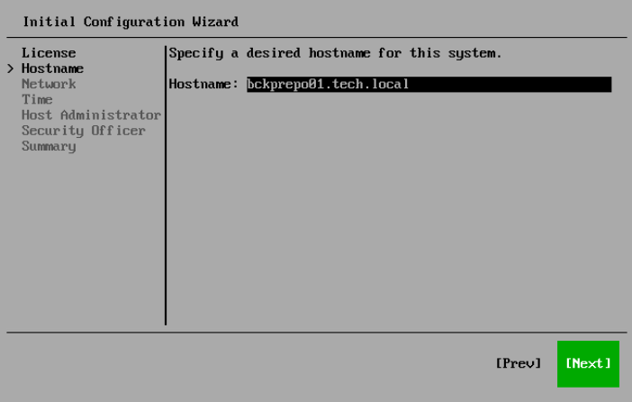

# Step 5. Specify Hostname

At the Hostname step of the Initial Configuration wizard, specify the name of the server and select Next.

|  |
| --- |
| Note |
| It is recommended that you use a Fully Qualified Domain Name as a hostname. |

You can change the server name later in the Host Management console. For more information, see [Changing Server Name](hmc_configure_hostname.md).

