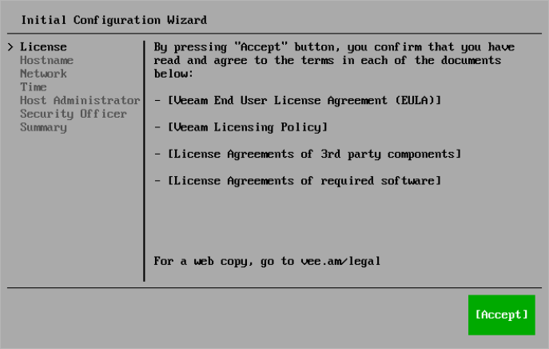

# Step 4. Read and Accept License Agreements

At the License step of the Initial Configuration wizard, read and accept Veeam license agreements and policies.

|  |
| --- |
| Tip |
| To close a document you have read, press [Q]. |

