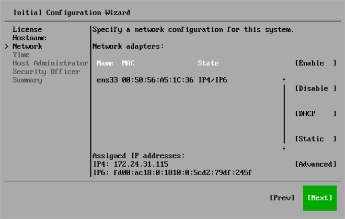

# Step 6. Review Network Settings

At the Network step of the Initial Configuration wizard, review the network configuration.

By default, all enabled network adapters will be configured to use DHCP. To specify a static IP address, select Static.

|  |
| --- |
| Note |
| For advanced network configuration through the nmtui tool, select Advanced. |

You can change network settings later in the Host Management console. For more information, see [Configuring Network Interfaces](hmc_configure_interfaces.md).

