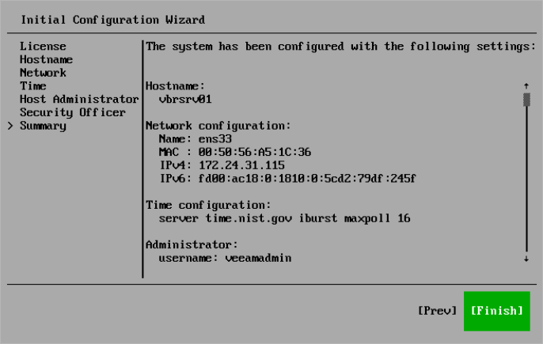

# Step 10. Finish Configuration

In this article

At the Summary step of the Initial Configuration wizard, review the system configuration and select Finish. The system will apply the configuration and restart required services.

After you finish the initial configuration, general information about the server will be displayed. You can use it to log in to the Host Management console or Veeam Backup & Replication web UI and continue configuring Veeam Software Appliance and Veeam Backup & Replication.

Related Topics

* [Configuring Veeam Appliances](hmc.md)
* [Configuring Veeam Backup & Replication Settings](vbr_configuring.md)

Page updated 10/8/2025

Page content applies to build 13.0.1.1071
