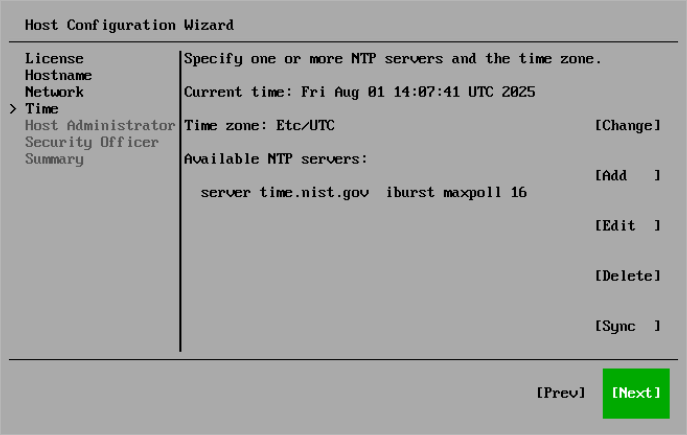

# Step 7. Review Server Time Settings

At the Time step of the Initial Configuration wizard, review server time configuration. Server time affects multi-factor authentication and backup operations, for example, backup job schedule.

Configure the following server time settings:

* Time zone. By default, UTC is used. To specify another time zone, select Change.
* Available NTP servers. By default, the time.nist.gov NTP server is used. You can add multiple NTP and NTS servers. It is recommended to use a minimum of 3 to mitigate timing issues.

|  |
| --- |
| Note |
| NTS servers must use a certificate signed by a public certificate authority. |

To synchronize time on the backup server with the NTP servers, select Sync.

You can change server time settings later in the Host Management console. For more information, see [Configuring Server Time Settings](hmc_configure_time.md).

