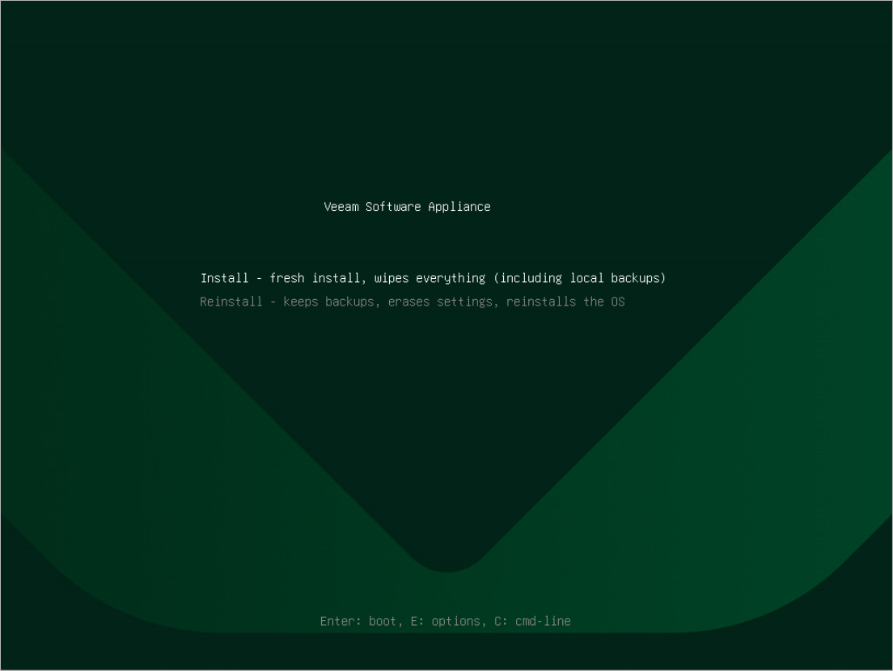

# Step 3. Begin Installation

In the installation menu, select Install and press [Enter].

When the installer is loaded, confirm the operation.

After the installation is complete, do the following:

1. Select Reboot System or wait for the system to reboot automatically.
2. After the system reboots, complete the Initial Configuration wizard.

