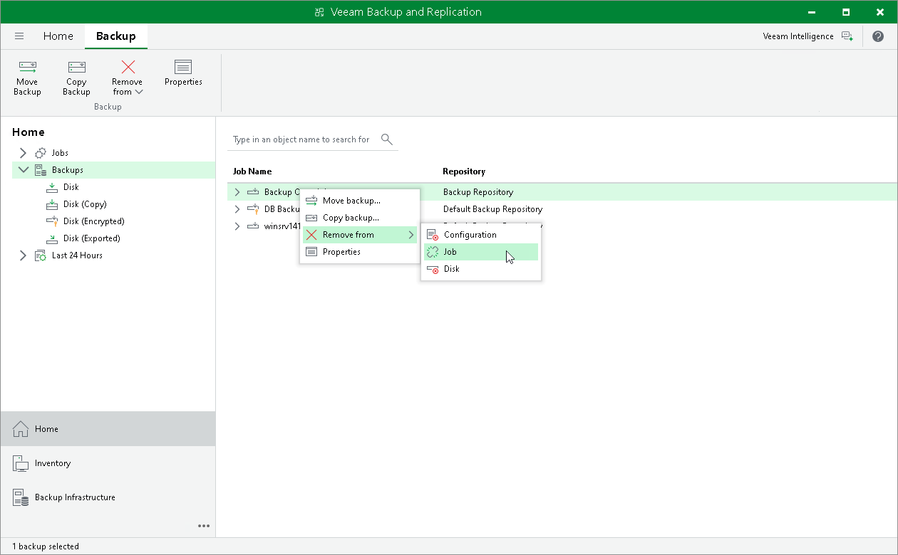

# Detaching Backups from Jobs

If you want to detach backups from a job, you can use the Detach from job operation.

When you detach backups from a job, the job stops processing these backup files. During the next run, the job will start a new backup chain; that is, will create active full backups.

The detached backup files remain in the backup repository and the Veeam Backup & Replication console. Veeam Backup & Replication shows the detached backups in the [inventory pane](vbr_ui.md) in the node with the (Orphaned) postfix. These backups are retained according to the background retention process. For more information, see [Background Retention](background_retention_job_hv.md).

To detach backups from a job:

1. Open the Home view.
2. In the inventory pane, select the Backups node.
3. In the working area, right-click the necessary backup and select Remove from > Job. Alternatively, click Remove from > Job on the ribbon.

