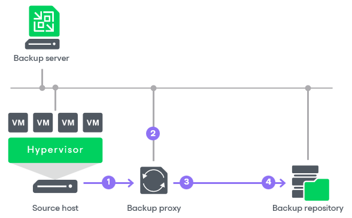
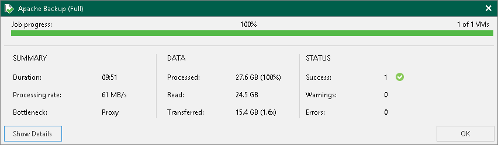

# Performance Bottlenecks

As any backup application handles a great amount of data, it is important to make sure the data flow is efficient and all resources engaged in the backup process are optimally used. Veeam Backup & Replication provides advanced statistics about the data flow efficiency and lets you identify bottlenecks in the data transmission process.

Veeam Backup & Replication processes VM data in cycles. Every cycle includes a number of stages:

1. Reading VM data blocks from the source
2. Processing VM data on the backup proxy
3. Transporting data over the network
4. Writing data to the target

When one data processing cycle is over, the next cycle begins. VM data, therefore, goes over the “data pipe”.

To evaluate the data pipe efficiency, Veeam Backup & Replication analyzes the performance of all components in the data flow working as a cohesive system and evaluates key factors on the source and target sites. Veeam Backup & Replication checks the following points in the data pipe:

1. Source — source disk reader component responsible for retrieving data from the source storage.
2. Proxy — backup proxy component responsible for processing VM data.
3. Source WAN accelerator — WAN accelerator deployed on the source site. Used for backup copy and replication jobs working through WAN accelerators.
4. Network — network queue writer component responsible for getting processed VM data from the backup proxy and sending it over the network to the backup repository or another backup proxy.
5. Target WAN Accelerator — WAN accelerator deployed on the target site. Used for backup copy and replication jobs working through WAN accelerators.
6. Target — target disk writer component (backup storage or replica datastore).

The resource usage level for these points is evaluated in percent. This percent rate defines the amount of time for which components are busy during the job. An efficient data flow assumes that there is no latency at any point of the data pipe, and all its components work for approximately equal amount of time.

If any of the components operates inefficiently, there may appear a bottleneck in the data path. The insufficient component will work 100% of the time while the others will be idling, waiting for data to be transferred. As a result, the whole data flow will slow down to the level of the slowest point in the data path, and the overall time of data processing will increase.

To identify a bottleneck in the data path, Veeam Backup & Replication detects the component with the maximum workload: that is, the component that works for the most time of the job. For example, you use a low-speed storage device as the backup repository. Even if VM data is retrieved from the SAN storage on the source site and transported over a high-speed link, VM data flow will still be impaired at the backup repository. The backup repository will be trying to consume transferred data at a rate that exceeds its capacity, and the other components will stay idle. As a result, the backup repository will be working 100% of the job time, while other components may be employed, for example, for 60% only. In terms of Veeam Backup & Replication, such a data path will be considered insufficient.

The bottleneck statistics for a job are displayed in the job session data. The bottleneck statistics do not necessarily mean that you have a problem in your backup infrastructure. They inform you about the weakest component in the data path. However, if you feel that the job performance is low, you may try taking some measures to get rid of the bottleneck. For example, in the case described above, you can limit the number of concurrent tasks for the backup repository.

Throttling as Bottleneck

In addition to main points in the data pipe, Veeam Backup & Replication may report throttling as a bottleneck. This can happen in the following cases:

* If you limit the read and write data rates for a backup repository, a backup repository may become a bottleneck. Veeam Backup & Replication will report Throttling in the bottleneck statistics.
* If you set up network throttling rules, network may become a bottleneck. Veeam Backup & Replication will report Throttling in the bottleneck statistics.

