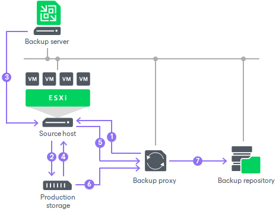

# Data Backup in Direct SAN Access Mode

In this article

To retrieve VM data blocks from a SAN LUN during backup, the VMware backup proxy uses metadata about the layout of VM disks on the SAN.

Data backup in the Direct SAN access transport mode includes the following steps:

1. The VMware backup proxy sends a request to the ESXi host to locate the necessary VM on the datastore.
2. The ESXi host locates the VM.
3. Veeam Backup & Replication triggers VMware vSphere to create a VM snapshot.
4. The ESXi host retrieves metadata about the layout of VM disks on the storage (physical addresses of data blocks).
5. The ESXi host sends metadata to the VMware backup proxy.
6. The VMware backup proxy uses metadata to copy VM data blocks directly from the source storage over the SAN.
7. The VMware backup proxy processes copied data blocks and sends them to the target.

Page updated 6/8/2023

Page content applies to build 13.0.1.1071
