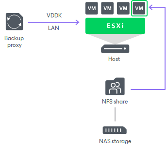
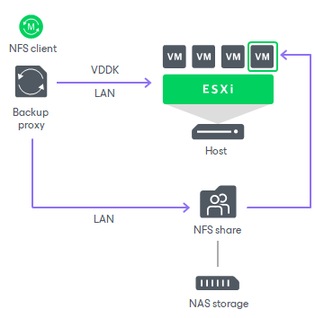

# Direct NFS Access

In this article

The Direct NFS access is a recommended transport mode for VMs whose disks are located on NFS datastores.

The Direct NFS access mode provides an alternative to the Network mode. When Veeam Backup & Replication processes VM data in the Network mode, it uses VMware VDDK to communicate with the ESXi host. This produces additional load on the ESXi host.

In the Direct NFS access mode, Veeam Backup & Replication bypasses the ESXi host and reads/writes data directly from/to NFS datastores. To do this, Veeam Backup & Replication deploys its native NFS client on the VMware backup proxy and uses it for VM data transport. VM data still travels over LAN but there is no load on the ESXi host.

The Direct NFS access mode can be used for all operations where the VMware backup proxy is engaged:

* Backup
* Replication
* Quick Migration
* VM copy
* Entire VM restore
* VM disk restore
* Replica failback

Requirements for the Direct NFS Access Mode

* Direct NFS access mode can be used in VMware vSphere environments running NFS version 3 and 4.1.
* The VMware backup proxy used for VM data processing must have access to the NFS datastores where VM disks are located. For more information, see [VMware Backup Proxy for Direct NFS Access Mode](direct_nfs_access_proxy.md).
* If NFS volumes are mounted on the ESXi host under names, not IP addresses, the volume names must be resolved by DNS from the VMware backup proxy.

Limitations for Direct NFS Access Mode

* Veeam Backup & Replication cannot parse delta disks in the Direct NFS access mode. For this reason, the Direct NFS access mode has the following limitations:

+ The Direct NFS access mode cannot be used for VMs that have at least one snapshot.
+ Veeam Backup & Replication uses the Direct NFS transport mode to read and write VM data only during the first session of the replication job. During subsequent replication job sessions, the VM replica will already have one or more snapshots. For this reason, Veeam Backup & Replication will use another transport mode to write VM data to the datastore on the target side. The source side proxy will keep reading VM data from the source datastore in the Direct NFS transport mode.

* If you enable the Enable VMware tools quiescence option in the job settings, Veeam Backup & Replication will not use the Direct NFS transport mode to process running Microsoft Windows VMs that have VMware Tools installed. The Direct NFS transport mode is not used because during VM quiescence VMware creates a snapshot with two delta disks per virtual disk.

* If a VM has some disks that cannot be processed in the Direct NFS access mode, Veeam Backup & Replication processes these VM disks in the Network transport mode.

Related Topics

* [VMware Backup Proxy for Direct NFS Access Mode](direct_nfs_access_proxy.md)
* [Data Backup in Direct NFS Access Mode](direct_nfs_access_backup.md)
* [Data Restore in Direct NFS Access Mode](data_restore_in_direct_nfs_acc.md)
* [Failover to Network Mode](network_mode_failover.md)
* [Adding VMware Backup Proxies](add_vmware_proxy.md)

Page updated 5/15/2024

Page content applies to build 13.0.1.1071
