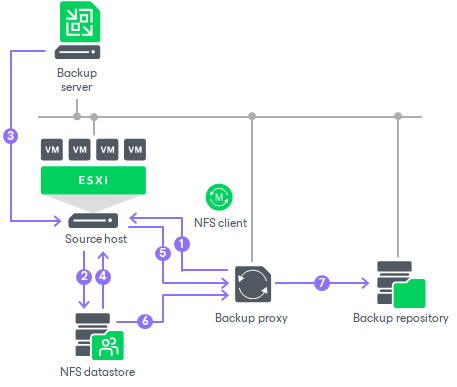

# Data Backup in Direct NFS Access Mode

Data backup in the Direct NFS access transport mode is performed in the following way:

1. The VMware backup proxy sends a request to the ESXi host to locate a VM on the NFS datastore.
2. The ESXi host locates the VM.
3. Veeam Backup & Replication triggers VMware vSphere to create a VM snapshot.
4. The ESXi host retrieves metadata about the layout of VM disks on the storage (physical addresses of data blocks).
5. The ESXi host sends metadata to the VMware backup proxy.
6. The VMware backup proxy uses metadata to copy VM data blocks directly from the NFS datastore over LAN.
7. The VMware backup proxy processes copied data blocks and sends them to the target over LAN.

