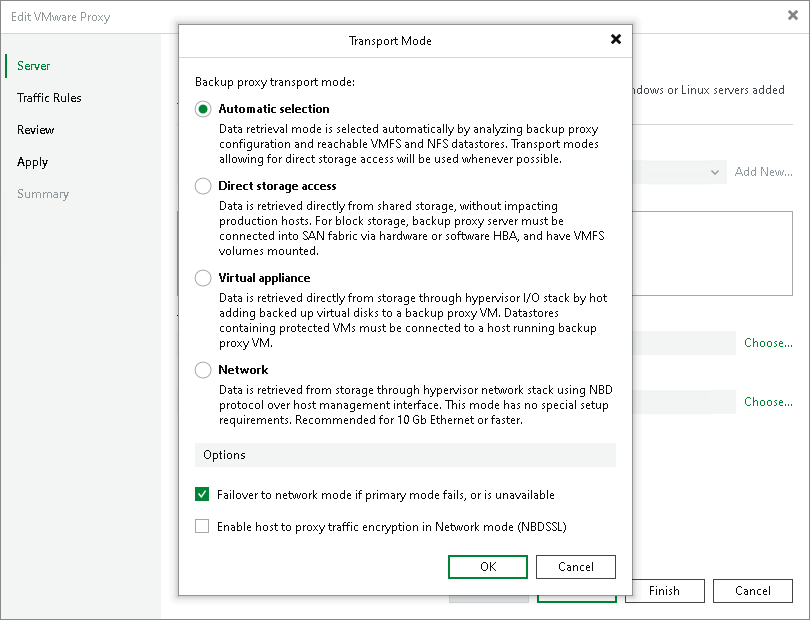

# VMware Backup Proxy for Direct NFS Access Mode

To instruct the VMware backup proxy to use the Direct NFS access mode, you must choose the Automatic selection or Direct storage access option in the VMware backup proxy settings.

To read and write data in the Direct NFS transport mode, the VMware backup proxy must meet the following requirements:

1. The VMware backup proxy must have access to the NFS datastore.
2. The VMware backup proxy must have ReadOnly/Write permissions and root access to the NFS datastore.

Veeam Backup & Replication deploys its NFS agent on every VMware backup proxy when you assign the VMware backup proxy role to a Microsoft Windows server (physical or virtual). Linux-based backup proxies must have NFS client package installed. For more information, see [Requirements and Limitations for VMware Backup Proxy on Linux](backup_proxy_requirements.md#linux).

VMware Backup Proxy Selection

Veeam Backup & Replication selects backup proxies working in the Direct NFS access transport mode by the following rules:

* If you instruct Veeam Backup & Replication to select a VMware backup proxy automatically for a job or task, Veeam Backup & Replication picks a VMware backup proxy with the minimum number of hops to the NFS datastore. If there are several backup proxies with the equal number of hops in the backup infrastructure, Veeam Backup & Replication picks the least busy VMware backup proxy in the backup infrastructure.

If all backup proxies with the minimum number of hops are busy at the moment, Veeam Backup & Replication waits until these backup proxies are free. Veeam Backup & Replication does not pick a VMware backup proxy that has a greater number of hops to the NFS datastore and works in the Direct NFS access or Virtual appliance transport mode.

* If you select one or more backup proxies explicitly for a job or task, Veeam Backup & Replication does not regard the number of hops to the NFS datastore. Veeam Backup & Replication picks the least busy VMware backup proxy working in the Direct NFS access transport mode.

If all backup proxies working in the Direct NFS access transport mode are busy, Veeam Backup & Replication waits until these backup proxies are free. Veeam Backup & Replication does not pick a VMware backup proxy working in the Virtual appliance transport mode.

To detect the number of hops from a VMware backup proxy to the NFS datastore, Veeam Backup & Replication uses the host discovery process. During host discovery, Veeam Backup & Replication obtains information about the number of hops, checks to which NFS datastores the VMware backup proxy has access and what permissions the VMware backup proxy has on NFS datastores.

The host discovery process rescans all machines to which the VMware backup proxy role is assigned. The process starts automatically every 4 hours. Host discovery is also triggered when you change the transport mode settings and choose to use the Direct storage access for the VMware backup proxy.

If necessary, you can start the host discovery process manually. To do this, perform the Rescan operation for a machine to which the VMware backup proxy role is assigned.

