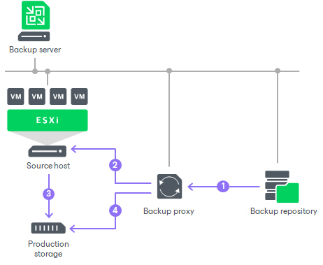

# Data Restore in Direct SAN Access Mode

The Direct SAN access transport mode can be used to restore VMs with thick disks. To restore VMs with thin disks, you can use the [Direct NFS access](data_restore_in_direct_nfs_acc.md), [Virtual appliance](virtual_appliance.md) or [Network](network_mode.md) mode.

|  |
| --- |
| Tip |
| If you plan to process VMs that have both thin and thick disks, you can enable the Direct SAN access mode. However, Veeam Backup & Replication will use the Network transport mode to restore disks of these VMs. If you want to use Direct SAN access mode, restore all VM disks as thick. |

Data restore in the Direct SAN access transport mode includes the following steps:

1. The VMware backup proxy retrieves data blocks from the backup repository or a datastore in the target site.
2. The VMware backup proxy sends a request to the ESXi host in the source site to restore data to a necessary datastore.
3. The ESXi host in the source site allocates space on the datastore.
4. Data blocks are written to the datastore.

