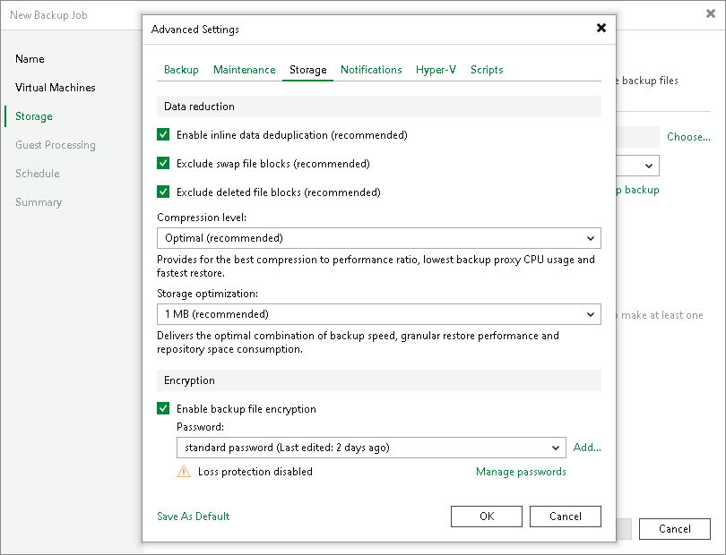
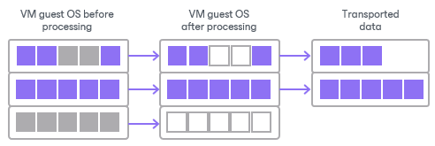

# Deleted File Blocks (BitLooker)

In this article

Deleted file block exclusion is a technology that reduces the backup size and time needed to create a backup. As a rule, file systems do not zero out blocks of permanently deleted files; they only remove information about such files from the file allocation table. It means the file content still exists on the disk image and enlarges the backup size. Deleted file block exclusion helps avoid copying this unnecessary data or, in Veeam terms, "dirty" blocks.

By default, deleted file block exclusion is enabled. If you do not want to exclude deleted file blocks from backups or replicas, you can disable the Exclude deleted file blocks option in the backup or replication job settings.

|  |
| --- |
| Note |
| If you enable or disable the Exclude deleted file blocks setting for the existing job, Veeam Backup & Replication will apply the new setting from the next job session. |

How Deleted File Block Exclusion Works

With this option enabled, Veeam Backup & Replication performs the following operations during the job session:

1. Veeam Backup & Replication accesses the MFT file on the VM guest OS to identify deleted file blocks and zeros out these blocks.
2. Veeam Backup & Replication processes and transports data blocks of the VM image in the following manner:

+ If a data block of the VM image contains only the deleted file blocks, Veeam Backup & Replication does not read this data block from the source volume.
+ If a data block of the VM image contains zeroed-out blocks and other data, Veeam Backup & Replication copies this block to the target. Due to data compression, data blocks that are marked as deleted are compressed, and the size of the resulting backup or replica file reduces.

Limitations for Deleted File Blocks Exclusion

Deleted file blocks exclusion has the following limitations:

* Veeam Backup & Replication can exclude deleted file blocks only on the VM guest OS with Microsoft NTFS.
* Veeam Backup & Replication supports both basic and dynamic disks. For the dynamic disks, simple type of volumes is supported. Spanned, mirrored and striped volumes are not supported.

Page updated 2/11/2025

Page content applies to build 13.0.1.1071
