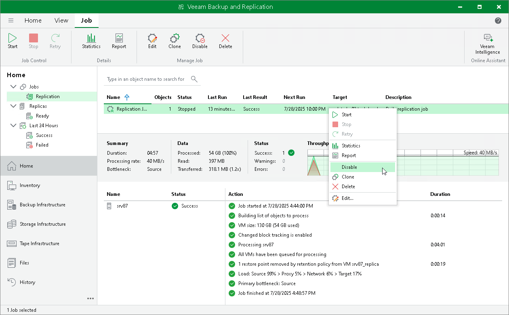
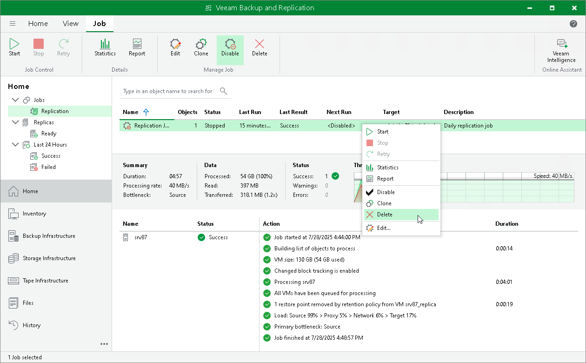

# Disabling and Deleting Replication Jobs

In this article

You can temporary disable scheduled jobs. The disabled job is paused for some period of time and is not run by the specified schedule. You can enable a disabled job at any time. You can also permanently delete a job from Veeam Backup & Replication and from the configuration database.

Disabling Jobs

To disable a replication job:

1. Open the Home view.
2. In the inventory pane, navigate to the Jobs > Replication node.
3. In the working area, select the necessary policy and select Disable on the ribbon. Alternatively, you can right-click the necessary policy and select Disable.

To enable a disabled replication job, select it and click Disable on the ribbon once again.

Deleting Jobs

To delete a replication job:

1. Open the Home view.
2. In the inventory pane, navigate to the Jobs > Replication node.
3. In the working area, select the necessary replication job and select Delete on the ribbon. Alternatively, you can right-click the necessary replication job and select Delete.

|  |
| --- |
| Note |
| Veeam Backup & Replication allows you to delete only stopped replication jobs. |

After you delete the job, the replicas created by this job are displayed under the Replicas node. If you want to remove replicas from the Veeam Backup & Replication console and configuration database but keep them on hosts, follow the instructions provided in [Removing Replicas from Configuration](remove_replica_from_configuration_hv.md). If you want to remove replicas not only from Veeam Backup & Replication, but also from host storage, follow the steps in [Deleting Replicas from Disk](delete_replica_from_disk_hv.md).

Page updated 1/29/2025

Page content applies to build 13.0.1.1071
