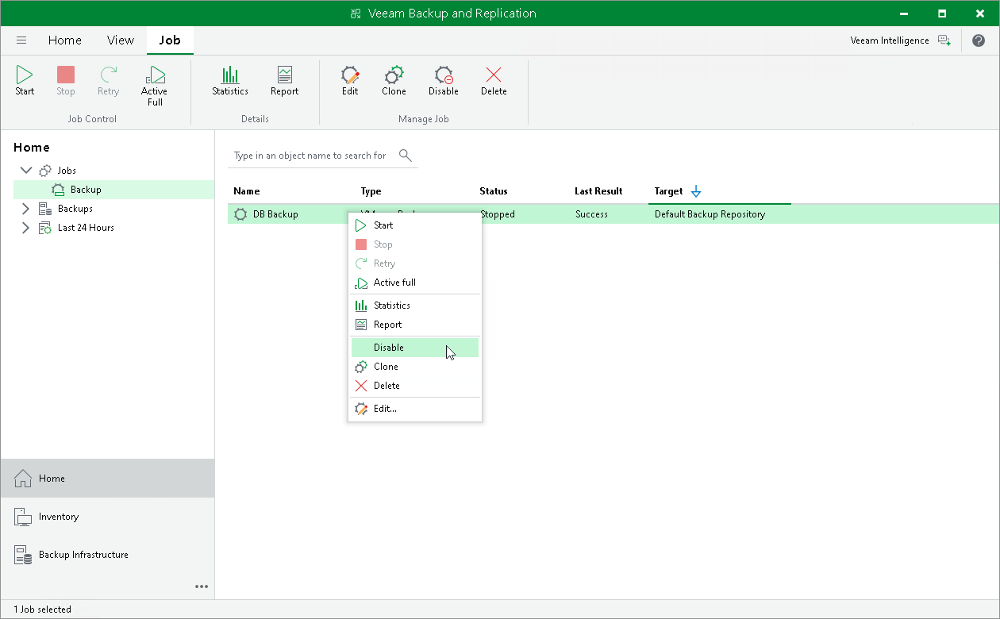
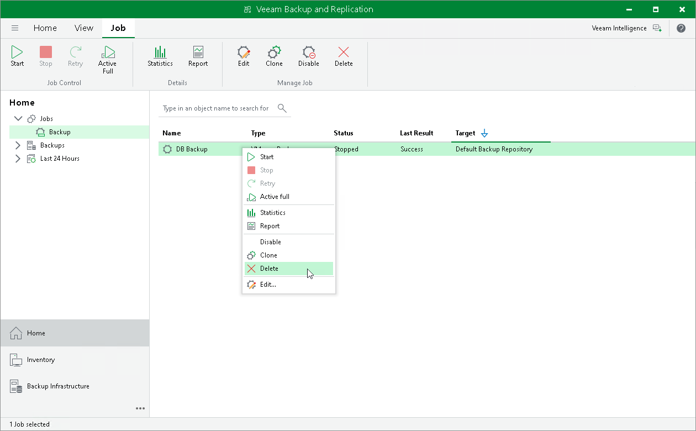

# Disabling and Deleting Jobs

In this article

You can temporarily disable scheduled jobs. The disabled job is paused for some period of time and is not run by the specified schedule. You can enable a disabled job at any time. You can also permanently delete a job from Veeam Backup & Replication and the configuration database.

Disabling Jobs

To disable a job:

1. Open the Home view.
2. In the inventory pane, navigate to the Jobs > Backup node.
3. In the working area, select the job and select Disable on the ribbon or right-click the job and select Disable.

To enable a disabled job, select it in the list and click Disable on the ribbon once again.

Deleting Jobs

To delete a job:

1. Open the Home view.
2. In the inventory pane, navigate to the Jobs > Backup node.
3. In the working area, select the job and click Delete on the ribbon or right-click the job and select Delete.

After a job is deleted, the backups created by this job are displayed under the Backups > Disk (Orphaned) node. If the backup files created by this job were also stored in [capacity tier](capacity_tier.md) or [archive tier](archive_tier.md), they will also be displayed under the Backups > Object Storage (Orphaned) or Backups > Archive (Orphaned) nodes.

Page updated 9/23/2025

Page content applies to build 13.0.1.1071
