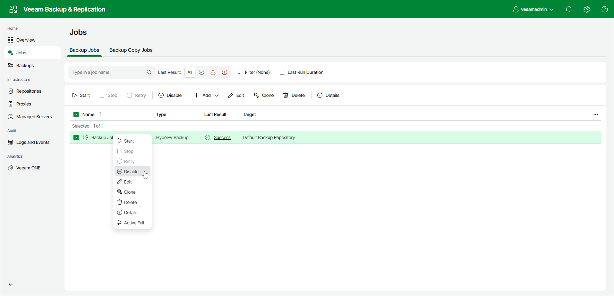
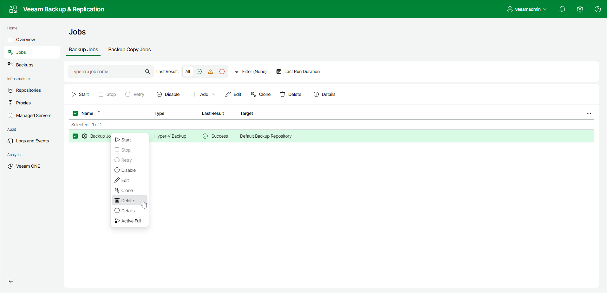

# Disabling and Deleting Jobs

You can temporarily disable scheduled jobs. The disabled job is paused for some period of time and is not run by the specified schedule. You can enable a disabled job at any time. You can also permanently delete a job from Veeam Backup & Replication and the configuration database.

Disabling Jobs

To disable a job:

1. In the management pane, click the Jobs node.
2. In the working area, select a job and click Disable on the ribbon or right-click the job and select Disable.

To enable a disabled job, select it in the list and click Enable on the ribbon.

|  |
| --- |
| Note |
| If the [health check](backup_health_check.md) is enabled in the job settings, it will continue to run according to its own schedule, regardless of the job status. |

Deleting Jobs

To delete a job:

1. In the management pane, click the Jobs node.
2. In the working area, select a job and click Delete on the ribbon or right-click the job and select Delete.

After you delete a job, the backups created by this job are displayed in the Backups node. Their backup type is changes to Orphaned.

