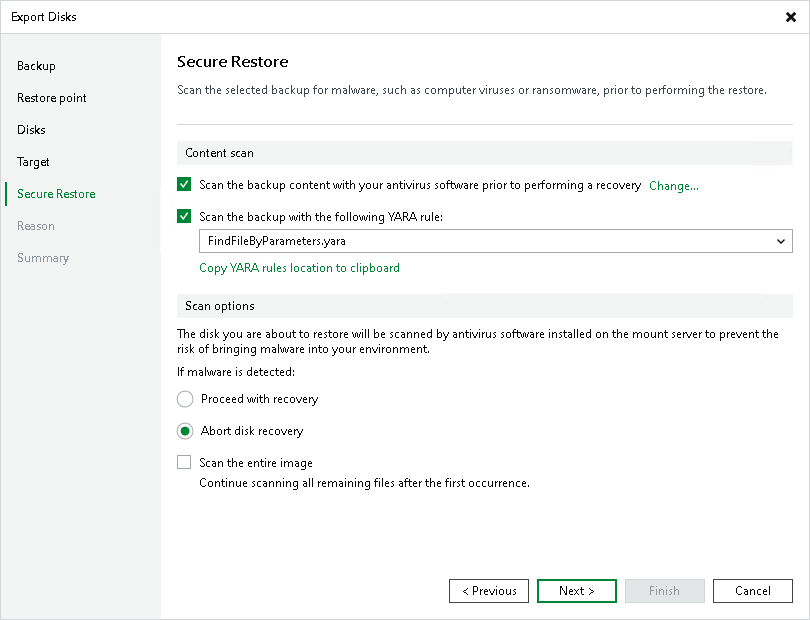

# Step 6. Specify Secure Restore Settings

In this article

This step is available if you export disks of Microsoft Windows workloads.

At the Secure Restore step of the wizard, you can instruct Veeam Backup & Replication to scan machine data for malware activity before restoring the machine to the production environment. To scan the data, Veeam Backup & Replication uses the following engines:

* Veeam Threat Hunter — a signature-based scan engine. For more information, see [Veeam Threat Hunter for Secure Restore](secure_restore_veeam_threat_hunter.md).
* Third-party antivirus software. For more information, see [Antivirus Scan for Secure Restore](secure_restore_antivirus.md).
* YARA — a rule-based scan engine. For more information, see [YARA Scan for Secure Restore](secure_restore_yara.md).

To specify secure restore settings, do the following:

1. Select the method you want to use for data scan:

* Select the Scan restore points with Veeam Threat Hunter option to use Veeam Threat Hunter.

This option is available if you configured Veeam Threat Hunter as detection engine in [Signature Detection](malware_detection_signature_detection.md) settings.

* Select the Scan restore points with your existing antivirus software to use third-party antivirus software.

This option is available if you configured third-party antivirus in the [Signature Detection](malware_detection_signature_detection.md) settings.

|  |
| --- |
| Tip |
| Click Change to open Malware Detection Settings window where you can change your scan engine to Veeam Threat Hunter. |

* Select Scan the restore point with the following YARA rule to use YARA as a scan engine.

For a YARA rule to appear in the drop-down list, it must be placed in the YaraRules folder in the Veeam Backup & Replication product folder.

|  |
| --- |
| Tip |
| To copy the path to the folder with YARA rules, click Copy YARA rules location to clipboard. |

1. Specify how Veeam Backup & Replication must behave after the first malware threat is found: continue or abort disk recovery.

1. Select the Continue scanning all remaining files after the first occurrence check box if you want to continue the disk scan after the first virus threat is detected. For information on how to view results of the malware scan, see [Viewing Malware Scan Results](av_scan_log.md).

Page updated 3/11/2025

Page content applies to build 13.0.1.1071
