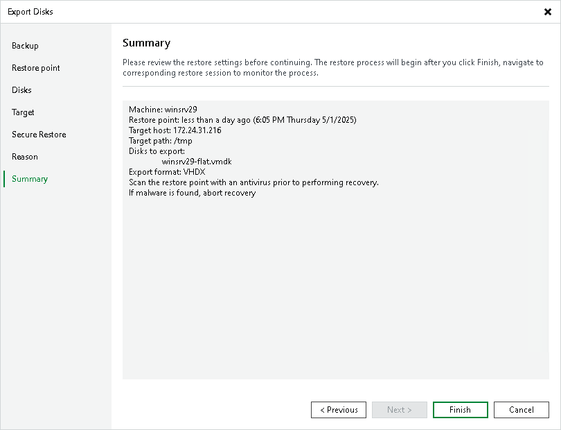

# Step 8. Finish Working with Wizard

In this article

At the Summary step of the wizard, review the configured settings and click Finish.

Page updated 3/11/2025

Page content applies to build 13.0.1.1071
