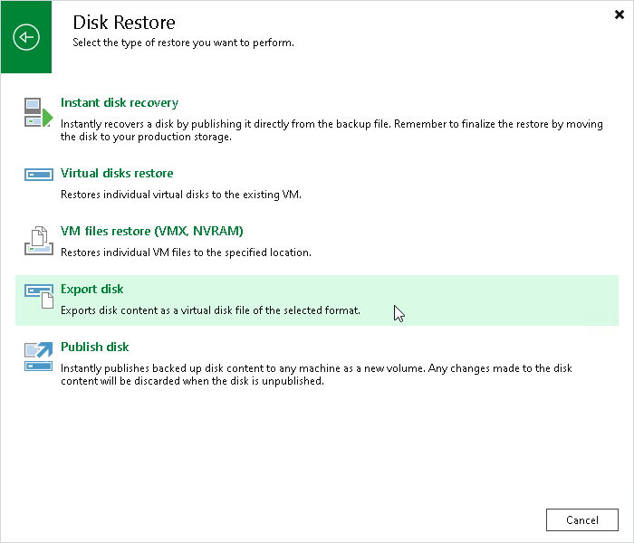

# Step 1. Launch Export Disk Wizard

In this article

To launch the Export Disk wizard, do one of the following:

* On the Home tab, click Restore and select one of the following:

* VMware vSphere > Restore from backup > Disk Restore > Export disk — to export disks of VMware vSphere VMs from a VM backup created by Veeam Backup & Replication.

* VMware Cloud Director > Restore from backup > VM restore > Disk Restore > Export disk — to export disks of VMware Cloud Director VMs from a VM backup created by Veeam Backup & Replication.
* Microsoft Hyper-V > Restore from backup > Entire VM restore > Export disk — to export disks of Hyper-V VMs from a VM backup created by Veeam Backup & Replication.

* Agent > Disk Restore > Export disk — to export disks of physical machines and virtual machines from backups created by Veeam Agent for Microsoft Windows, Veeam Agent for Linux or Veeam Agent for Mac.
* AWS > Amazon EC2 > Entire machine restore > Export disk — to export disks of EC2 instances from backups created by Veeam Backup for AWS.
* Azure IaaS backup> Entire machine restore > Export disk — to export disks of Azure VMs from backups created by Veeam Backup for Microsoft Azure.
* GCE backup > Entire machine restore > Export disk — to export disks of VM instances from backups created by Veeam Backup for Google Cloud.
* Nutanix backup > Entire machine restore > Export disk — to export disks of VMs from backups created by Veeam Plug-In for Nutanix AHV.
* oVirt KVM > Entire machine restore > Export disk — to export disks of VMs from backups created by Veeam Backup for OLVM and RHV.
* Kasten backup > Export disk — to export disks of VMs whose backups were exported by Kasten policies.

* Proxmox VE > Export disk — to export disks of Proxmox VE VMs from backups created by Veeam Plug-In for Proxmox VE.
* Scale Computing HyperCore > Export disk — to export disks of Scale Computing HyperCore VMs from backups created by Veeam Plug-In for Scale Computing HyperCore.

* Open the Home view. In the inventory pane, click Backups. In the working area, expand the necessary backup, select a workload whose disks you want to export and click Export Disks on the ribbon. Alternatively, you can right-click the workload and select Export content as virtual disks.

Page updated 11/13/2025

Page content applies to build 13.0.1.1071
