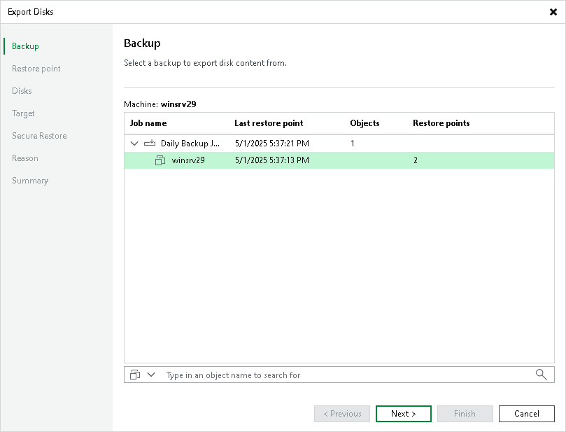

# Step 2. Select Backup

In this article

At the Backup step of the wizard, expand a backup and select the workload whose disks you want to export.

Page updated 3/11/2025

Page content applies to build 13.0.1.1071
