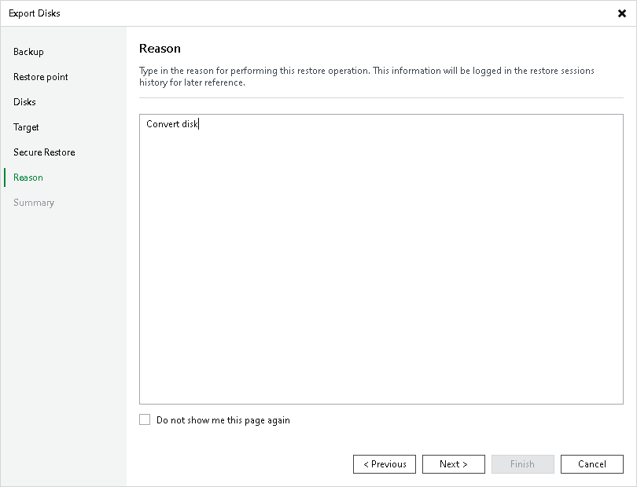

# Step 7. Specify Export Reason

In this article

At the Reason step of the wizard, enter a reason for disk export.

|  |
| --- |
| Tip |
| If you do not want to show this page, select the Do not show me this page again check box. If you want to unhide this page, follow the instructions described in [this Veeam KB article](https://www.veeam.com/kb4432). |

Page updated 3/11/2025

Page content applies to build 13.0.1.1071
