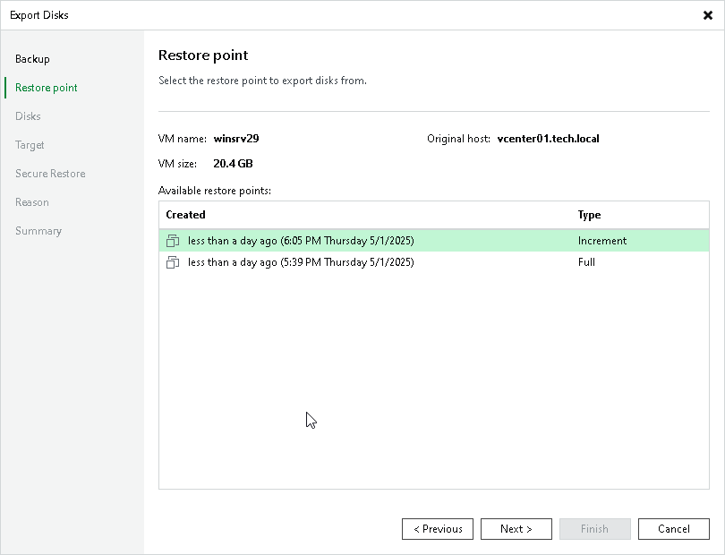

# Step 3. Select Restore Point

At the Restore Point step of the wizard, select the restore point from which you want to restore disks. By default, Veeam Backup & Replication restores disks to the latest state. However, you can restore disks to an earlier state.

