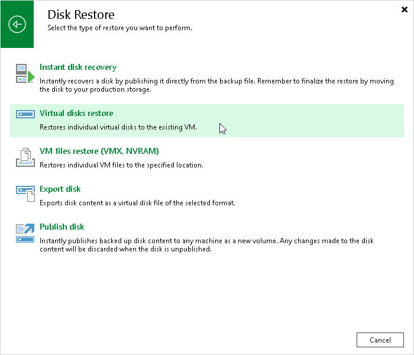

# Step 1. Launch Virtual Disk Restore Wizard

In this article

To launch the Virtual Disk Restore wizard, do one of the following:

* On the Home tab, click Restore > VMware vSphere > Restore from backup > Disk restore > Virtual disks restore.
* Open the Home view. In the inventory pane, select Backups. In the working area, expand the necessary backup, click the VM whose files you want to restore and click Virtual Disks on the ribbon. Alternatively, you can right-click the VM whose files you want to restore and select Restore virtual disks.

Page updated 5/19/2025

Page content applies to build 13.0.1.1071
