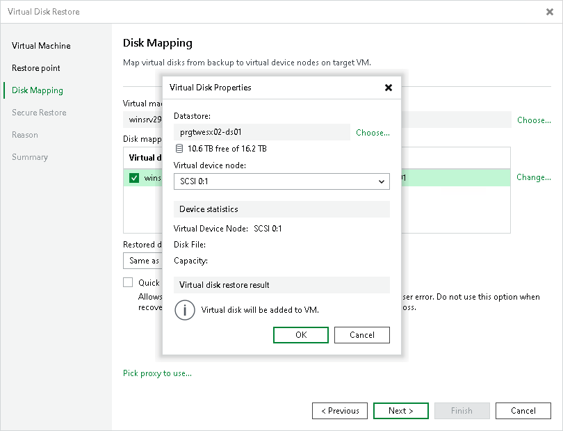

# Step 4. Select Virtual Hard Disks to Restore

At the Disk Mapping step, select virtual hard disks to restore, choose a VM to which the disks must be attached and define additional restore settings.

1. By default, Veeam Backup & Replication maps restored disks to the original VM. If the original VM was relocated or if you want to attach disks to another VM, you need to select the target VM manually. Click Choose and select the necessary VM from the virtual environment.

|  |
| --- |
| Important |
| You cannot attach restored disks to a VM that has one or more snapshots. |

1. In the Disk mapping list, select virtual disks that you want to restore.
2. To configure virtual disk properties, select a disk in the Disk mapping list and click Change. In the Virtual Disk Properties window, do the following:

1. Click Choose to pick a datastore where the restored hard disk must be placed.

If you use storage policies in the virtual environment, Veeam Backup & Replication displays information about storage policies in the Select Datastore window. You can select a datastore associated with the necessary storage policy.

1. From the Virtual device node drop-down list, select a virtual device node. If you want to replace an existing virtual disk, select an occupied virtual node. If you want to attach the restored disk to the VM as a new disk, select a node that is not occupied yet.
2. Click OK.

1. Veeam Backup & Replication preserves the format of the restored virtual hard disks. To change disk format, select the required option from the Restore disk type drop-down list. For more information about disk types, see [VMware Docs](https://docs.vmware.com/en/VMware-vSphere/6.0/com.vmware.vsphere.html.hostclient.doc/GUID-4C0F4D73-82F2-4B81-8AA7-1DD752A8A5AC.html).

|  |
| --- |
| Note |
| Disk format change is supported only for VMs with Virtual Hardware version 7 or later. |

1. [For disk restore to the original location and with original format] Select the Quick rollback check box if you want to use incremental restore for the VM disk. For more information on quick rollback, its requirements and limitations, see [Quick Rollback](incremental_restore.md).

It is recommended that you enable this option if you restore a VM disk after a problem that occurred at the level of the VM guest OS: for example, there has been an application error or a user has accidentally deleted a file on the VM guest OS. Do not enable this option if the problem has occurred at the VM hardware level, storage level or due to a power loss.

1. Click the Pick proxy to use link to select backup proxies over which VM data must be transported to the target datastore. By default, Veeam Backup & Replication assigns proxies automatically.

* If you choose Automatic selection, Veeam Backup & Replication will detect backup proxies that have access to the source datastore and will automatically assign optimal proxy resources for processing VM data.

During the restore process, VM hard disks are processed simultaneously. Veeam Backup & Replication checks available backup proxies. If more than one backup proxy is available, Veeam Backup & Replication analyzes transport modes that the backup proxies can use for writing data to target, current workload on these backup proxies, and selects the most appropriate resources for VM hard disk processing.

* If you choose Use the selected backup proxy servers only, you can explicitly select backup proxies that must be used for restore. It is recommended that you select at least two backup proxies to ensure that VM hard disks are recovered if one of backup proxies fails or loses its connectivity to the target datastore during restore.

