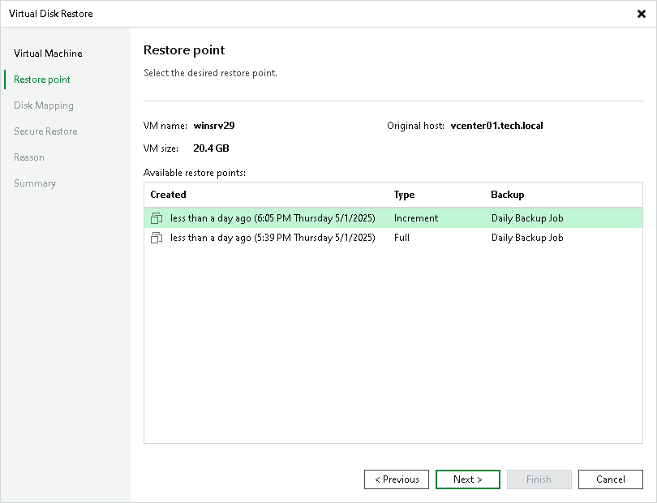

# Step 3. Select Restore Point

In this article

At the Restore Point step of the wizard, select a restore point from which you want to restore VM disks.

Page updated 5/30/2023

Page content applies to build 13.0.1.1071
